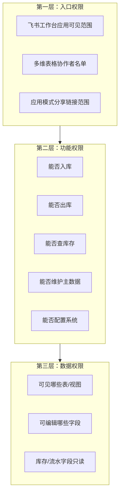
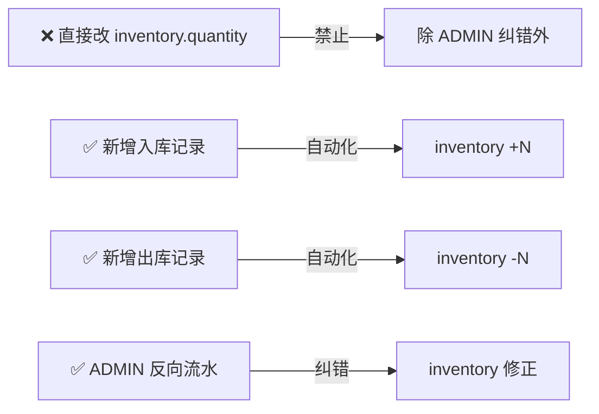
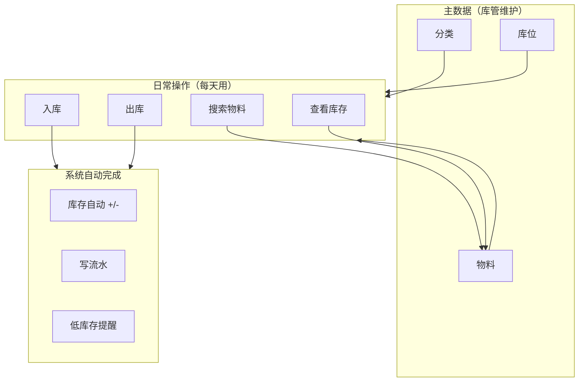
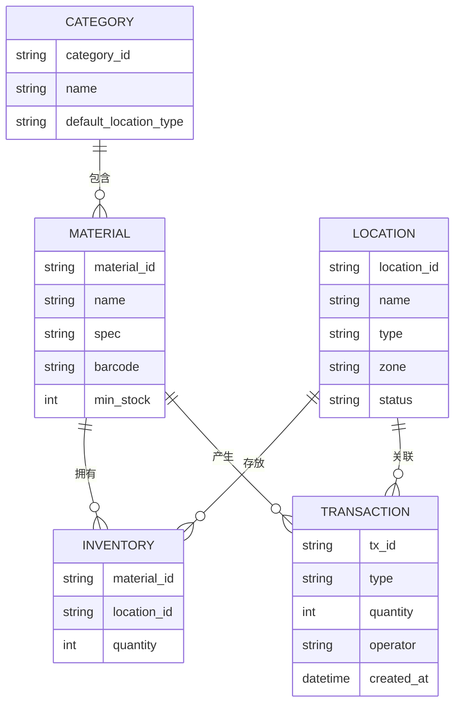

# 物料出入库管理系统 — 产品设计文档（PRD）

> **文档状态**：草案 v1.3（随讨论持续更新）
> **最后更新**：2026-06-15  
> **维护方式**：每次需求/决策变更后，更新对应章节并在文末「变更记录」追加条目

---

## 1. 文档说明

### 1.1 目的

本文档描述「物料出入库管理系统」的产品目标、用户场景、功能范围与交互设计，作为开发、验收与后续迭代的依据。

### 1.2 参考来源

| 来源 | 说明 |
|------|------|
| [飞书 Wiki 产品设计文档](https://zcnce50wan15.feishu.cn/wiki/Nzw3wX2USiIjtckGQbVckSQRnFf) | 立项背景、模块划分、技术方向 + **开发过程实录**（已合并） |
| [开发过程实录（飞书副本）](https://zcnce50wan15.feishu.cn/docx/YJ4iduq3ToSma8xzuvuci9BlnJg) | 2026-06-10 AI 协作全流程，分享案例素材（独立副本） |
| 分类规则附图 | 机器人物料分类与存放位置约定 |
| 对话确认（2026-06-10） | 低访问量、专人维护、优先复用成熟方案 |

### 1.3 关联文档

- [架构设计文档](./架构设计文档.md)
- [AGENTS.md](../AGENTS.md) — 开发约定入口
- [.cursor/rules/stock-project-conventions.mdc](../.cursor/rules/stock-project-conventions.mdc) — Cursor 强制规则

---

## 2. 立项背景

### 2.1 业务背景

团队需要管理机器人研发相关的硬件物料（电机、传感器、算力板、线缆、结构件等）。当前物料分散在货柜、货架、专用架等多个位置，缺少统一的数字化台账，导致：

- 找物料耗时长，依赖个人记忆
- 出入库无标准记录，难以追溯
- 快递到货后暂存与正式上架流程不清晰
- 库存数量靠人工记账，易出错

### 2.2 产品定位

面向 **小团队、专人维护、低访问量** 的轻量级物料管理系统。核心目标是：

> **记清楚、找得到、可追溯** — 而非高并发、复杂 ERP。

### 2.3 设计原则

| 原则 | 说明 |
|------|------|
| 够用就好 | 不做高并发、复杂审批、财务对账 |
| 飞书原生 | 团队已在飞书，权限/通知/协作复用飞书能力 |
| 复用优先 | 优先采用飞书官方模板或成熟开源方案，避免从零造轮子 |
| 专人可维护 | 维护人既能通过「系统界面」操作，也能在多维表格直接管理主数据 |
| 可持续迭代 | 本文档随讨论更新，功能分阶段交付 |

### 2.4 产品本质（一句话）

> **物料电话簿 + 出入库签到本 + 实时库存表。**

系统要让团队随时能回答四个问题：

| 问题 | 对应能力 |
|------|---------|
| 有什么物料？ | 物料主数据 + 分类 |
| 放在哪里？ | 库位管理 + 库存分布 |
| 还剩多少？ | 库存查看 |
| 谁什么时候动过？ | 出入库流水 |

### 2.5 痛点与系统能力映射

| 现状痛点 | 系统要提供的能力 |
|---------|----------------|
| 找物料靠个人记忆 | 搜索（名称 / 条码 / 分类）→ 显示库位与库存 |
| 领用了没有记录 | 出库登记 → 自动写流水、扣库存 |
| 采购到货不知入库与否 | 入库登记 → 自动加库存 |
| 快递到了乱堆 | 快递暂存区入库 → 拆包后上架到正式库位 |
| 库存数量对不上 | 账面库存 + 流水追溯 + 定期盘点 |

---

## 3. 用户与角色

### 3.1 目标用户

| 角色 | 人数估计 | 主要诉求 |
|------|---------|---------|
| **库管/维护专员** | 1～2 人 | 出入库录入、库存核对、分类/库位维护 |
| **研发/项目成员** | 5～20 人 | 查物料在哪、剩多少、领用出库 |
| **管理员** | 1 人 | 权限配置、数据备份、规则调整 |

### 3.2 使用特征（已确认）

- 日出入库操作量：**几十笔以内**
- 并发访问：**极低**，无需考虑抢库存、限流
- 维护模式：**专人负责**，允许偶尔人工在表格中纠错
- 终端：飞书桌面端 + 手机端（扫码/搜索）

### 3.3 权限设计原则

| 原则 | 说明 |
|------|------|
| 飞书原生 | 不自建账号/RBAC 系统，完全复用飞书身份 + Bitable 协作者权限 |
| 角色精简 | 固定 3 个业务角色，不搞复杂岗位体系 |
| 最小权限 | 默认只能看和出库，写主数据、改库存仅限库管/管理员 |
| 库存不可手改 | `inventory.quantity` 仅通过出入库流水变更，禁止普通用户直接编辑 |
| 流水不可篡改 | `transactions` 只追加、不删除，纠错用反向流水 |
| 视图隔离 | 不同角色看到不同 Bitable 视图 / 应用模式页面，减少误操作 |

### 3.4 角色定义

| 角色代码 | 角色名称 | 典型人员 | 人数 |
|---------|---------|---------|------|
| `ADMIN` | 系统管理员 | IT 负责人 / 项目负责人 | 1 |
| `KEEPER` | 库管员 | 物料维护专员 | 1～2 |
| `USER` | 普通用户 | 研发、项目成员 | 5～20 |

> **角色关系**：`ADMIN` ⊃ `KEEPER` ⊃ `USER`（权限逐级收窄，管理员拥有全部能力）

### 3.5 三层权限模型



| 层级 | 控制什么 | 飞书实现方式 |
|------|---------|-------------|
| **入口层** | 谁能打开系统 | 工作台应用可见范围 + Bitable 协作者 |
| **功能层** | 谁能做什么操作 | H5 页面显隐 + FastAPI 接口鉴权 |
| **数据层** | 谁能看/改哪些数据 | Bitable 高级权限（表/视图/字段级） |

### 3.6 功能权限矩阵

| 功能 | ADMIN | KEEPER | USER | 说明 |
|------|:-----:|:------:|:----:|------|
| 搜索物料 | ✅ | ✅ | ✅ | 全员可用 |
| 查看库存 | ✅ | ✅ | ✅ | 全员可用 |
| 查看出入库流水 | ✅ | ✅ | ✅ | 全员可用 |
| **入库** | ✅ | ✅ | ❌ | 仅库管及以上，防随意加库存 |
| **出库（领用）** | ✅ | ✅ | ✅ | 研发可自行领用 |
| 快递暂存上架 / 库内移动 | ✅ | ✅ | ❌ | 库管操作 |
| 新增/编辑物料 | ✅ | ✅ | ❌ | 主数据维护 |
| 新增/编辑库位 | ✅ | ✅ | ❌ | 主数据维护 |
| 新增/编辑分类 | ✅ | ✅ | ❌ | 主数据维护 |
| 直接修改库存数量 | ✅ | ❌ | ❌ | 仅管理员纠错时可用 |
| 删除/修改流水记录 | ✅ | ❌ | ❌ | 仅管理员，且原则上用反向流水 |
| 库存盘点 | ✅ | ✅ | ❌ | 库管执行 |
| 配置自动化规则 | ✅ | ❌ | ❌ | 系统管理员 |
| 配置应用模式 | ✅ | ❌ | ❌ | 系统管理员 |
| 管理协作者权限 | ✅ | ❌ | ❌ | 系统管理员 |
| 导出/备份数据 | ✅ | ✅ | ❌ | 库管可导出，用户不可 |

> **待确认**：若希望研发也能入库（归还物料），将 USER 的「入库」改为 ✅ 即可。

### 3.7 数据权限矩阵（按表）

| 数据表 | ADMIN | KEEPER | USER |
|--------|-------|--------|------|
| `categories` 分类 | 读写 | 读写 | **只读** |
| `locations` 库位 | 读写 | 读写 | **只读** |
| `materials` 物料 | 读写 | 读写 | **只读** |
| `inventory` 库存 | 读写（含纠错） | **只读** | **只读** |
| `transactions` 流水 | 读写（含纠错） | **仅新增**（通过入/出库表间接触发） | **仅新增**（通过出库表单） |

#### 关键字段级控制

| 表.字段 | ADMIN | KEEPER | USER | 控制目的 |
|---------|-------|--------|------|---------|
| `inventory.quantity` | 可编辑 | **只读** | **只读** | 防止手改库存 |
| `transactions.*` | 可编辑 | **只追加** | **只追加** | 保证审计追溯 |
| `materials.barcode` | 可编辑 | 可编辑 | 只读 | 条码由库管维护 |
| `materials.min_stock` | 可编辑 | 可编辑 | 只读 | 预警阈值由库管设定 |

### 3.8 飞书落地配置

#### 3.8.1 协作者与飞书群组

建议创建飞书群组的对应关系：

| 飞书群组 | 对应角色 | Bitable 权限 |
|---------|---------|-------------|
| `物料管理-管理员` | ADMIN | 可管理 |
| `物料管理-库管` | KEEPER | 可编辑（配合字段限制） |
| `物料管理-全员` | USER | 可阅读 + 指定视图可编辑 |

配置步骤：

1. 在多维表格「分享」→「管理协作者」中添加以上群组
2. 开启「高级权限」，按表/视图/字段细化（见架构文档 §9）
3. 工作台应用可见范围设为「物料管理-全员」群组

#### 3.8.2 视图隔离（按角色）

为每张表创建角色专用视图，在高级权限中按视图授权：

| 视图名称 | 面向角色 | 用途 |
|---------|---------|------|
| `物料-全员只读` | USER | 搜索、查看物料信息 |
| `物料-库管维护` | KEEPER | 新增/编辑物料 |
| `库位-全员只读` | USER | 查看库位 |
| `库位-库管维护` | KEEPER | 新增/编辑库位 |
| `库存-全员只读` | ALL | 查看库存，`quantity` 字段只读 |
| `入库-库管操作` | KEEPER | 入库表单，允许新增 |
| `出库-全员操作` | ALL | 出库表单，允许新增 |
| `流水-全员只读` | ALL | 查看操作记录 |
| `流水-管理员` | ADMIN | 纠错时查看完整流水 |

#### 3.8.3 H5 网页应用页面分配（MVP 主入口）

| H5 页面 | 可见角色 | 后端 API |
|---------|---------|----------|
| 首页（搜索） | ALL | `GET /materials/search` |
| 出库 | ALL | `POST /outbound` |
| 入库 | KEEPER, ADMIN | `POST /inbound` |
| 物料详情 | ALL | `GET /materials/{id}` |

> USER 不显示「入库」入口；`POST /inbound` 对 USER 返回 403。主数据维护可走 Bitable 管理视图（库管）。

#### 3.8.4 Bitable 应用模式（备用，非 MVP 主入口）

库管灾备或快速改表时，可保留应用模式链接，不作为研发日常入口。

#### 3.8.5 库存变更的唯一合法路径



### 3.9 审计与追责

| 机制 | 实现 |
|------|------|
| 操作人记录 | `transactions.operator` 自动填入当前飞书用户 |
| 操作时间 | `transactions.created_at` 自动记录 |
| 飞书编辑历史 | Bitable 自带记录修订历史，管理员可回溯 |
| 禁止删流水 | 高级权限禁止 DELETE；视图中隐藏删除按钮 |
| 纠错流程 | 发现错误 → 管理员新增反向流水 → 备注关联原 `tx_id` |

### 3.10 权限相关待决事项

| # | 问题 | 当前倾向 |
|---|------|---------|
| P-1 | 研发能否入库（归还物料）？ | 倾向 **仅库管可入库** |
| P-2 | 研发出库是否需填「项目/用途」？ | 倾向 **必填**，便于追溯 |
| P-3 | 是否需要「只读查看者」角色（如财务）？ | 暂不需要，按需加 |
| P-4 | 离职人员如何回收权限？ | 从飞书群组移除即可 |

---

## 4. 典型使用场景

本章说明「谁在什么情况下怎么用系统」，是功能设计的出发点。设计产品时，**先把以下场景走通，再考虑加功能**。

### 4.1 场景总览

| # | 场景 | 操作人 | 频率 | 涉及功能 |
|---|------|--------|------|---------|
| S1 | 研发领用物料 | USER | 每天数次 | 搜索、看库存、出库 |
| S2 | 采购到货入库 | KEEPER | 每周数次 | 入库、选库位 |
| S3 | 快递到货暂存 | KEEPER | 每周 1～2 次 | 入库（暂存区）、库内移动/上架调拨 |
| S4 | 新人查找物料 | ALL | 每天 | 搜索、物料详情 |
| S5 | 项目结束归还 | KEEPER | 偶尔 | 入库 |
| S6 | 库管定期核对 | KEEPER | 每月 1 次 | 按库位查库存、盘点 |
| S7 | 物料快用完 | 系统→KEEPER | 系统触发 | 低库存预警 |

> **80% 日常使用只涉及两类操作**：研发「搜 + 出库」；库管「入库 + 维护主数据」。

### 4.2 场景详细描述

#### S1：研发领用物料（最高频）

```
小王要做实验，需要一个大喵电机
  → 打开系统，搜索「大喵电机」
  → 看到：A区货柜-02，库存 3 个
  → 填出库单：数量 1，用途「XX 项目测试」
  → 库存变为 2，流水记录「小王 / 日期 / 领用 1 个」
```

#### S2：采购到货入库

```
采购的 10 个激光雷达到货
  → 库管选择「激光雷达」
  → 选库位「B区货柜-01」
  → 填数量 10，备注「采购单号 xxx」
  → 库存 +10
```

#### S3：快递到货暂存 → 上架

```
快递到了，尚未拆包
  → 库管入库到「快递暂存区」，数量 1 箱
  → 几天后拆开，确认是 5 个驱动器
  → 从暂存区调出，正式入库到「A区货柜-03」，数量 5
```

#### S4：新人查找物料

```
实习生：「同川电机在哪？」
  → 搜索「同川」或扫条码
  → 显示：分类=电机模组，位置=A区货柜-01，库存=2
```

#### S5：项目结束归还

```
项目结束，剩余 2 个相机需归还
  → 库管入库：相机 × 2，备注「XX 项目归还」
  → 库存恢复
```

> 归还目前倾向由 **库管入库**（USER 不可入库），见 §3.10 P-1。

#### S6：库管定期核对（P2）

```
月底库管核对实物与账面
  → 按库位查看库存清单
  → 逐项核对
  → 有差异则记「盘点调整」流水
```

#### S7：低库存预警（P2）

```
某螺丝库存剩 3 个，安全库存为 10
  → 系统通知库管
  → 库管安排采购
```

### 4.3 角色日常使用摘要

| 角色 | 每天做什么 | 用到哪些功能 |
|------|-----------|-------------|
| **研发（USER）** | 找物料、领用 | 搜索、看库存、出库 |
| **库管（KEEPER）** | 收货入库、上架、维护台账 | 入库、搜索、维护物料/库位/分类、暂存上架 |
| **管理员（ADMIN）** | 偶尔纠错、调规则 | 全部 + 权限与自动化配置 |

### 4.4 功能分层指引

设计时按三层推进，**避免一开始做太多**。

#### 第一层：必须有（MVP）

没有就无法日常使用：

| 功能 | 解决什么 | 典型操作 |
|------|---------|---------|
| 物料主数据 | 系统里有哪些物料 | 录入名称、分类、规格、条码 |
| 库位管理 | 东西放哪 | 维护货柜、货架、暂存区 |
| 分类管理 | 按类别组织 | 电机模组、感知设备等 |
| 入库 | 物料进入仓库 | 选物料 → 选库位 → 填数量 |
| 出库 | 物料被领走 | 选物料 → 选库位 → 填数量 + 用途 |
| 库存查看 | 还剩多少 | 按物料 / 库位查看数量 |
| 搜索 | 快速找到 | 按名称、分类、条码搜索 |
| 出入库流水 | 追溯 | 记录谁、何时、入/出多少 |

#### 第二层：建议有（用起来更顺手）

| 功能 | 解决什么 | 优先级 |
|------|---------|--------|
| 快递暂存 → 上架 / 库内移动 | 到货先堆、拆包后归位；库位整理 | P1 |
| 扫码 | 手机扫条码快速定位 | P1 |
| 权限分角色 | 研发只能出库，库管能入库 | P1 |
| 出库必填用途 | 知道领用去向 | P2 |
| 物料图片 | 看图认货 | P2 |
| 低库存预警 | 快没了提醒库管 | P2 |

#### 第三层：以后再说

| 功能 | 为什么暂不做的原因 |
|------|------------------|
| 采购管理 | 采购在别处完成，到货后入库即可 |
| 审批流 | 团队小，口头确认够用 |
| 财务报表 / 成本核算 | 非当前目标 |
| 批次 / 序列号追踪 | 物料量级增大后再考虑 |
| 多仓库 | 目前仅一个实验室 |
| 统计看板 | 数据积累后再做 |
| 盘点模块 | 初期可人工核对，流程成熟后系统化 |

### 4.5 功能关系图



**推荐设计顺序**：

1. 先建主数据（分类、库位、物料）
2. 再做日常操作（入库、出库、搜索）
3. 最后加自动化（库存联动、预警）

### 4.6 产品设计步骤指引

| 步骤 | 做什么 | 预估时间 |
|------|--------|---------|
| Step 1 | 理清「物」和「位」：列分类、库位、常用物料（先 20～30 个高频） | 1 天 |
| Step 2 | 定 3 条核心流程：出库、入库、查找 | 0.5 天 |
| Step 3 | 确定组合方案：Erniu/官方模板 + lark-samples + 薄自研 | 已定 |
| Step 4 | P0：fork 模板改五表 → P1：迁入 lark-samples → 8 API + 4 H5 页 | 约 1 周 |
| Step 5 | 试运行 1 周：库管 + 2～3 名研发真实使用，收集问题 | 1 周 |
| Step 6 | 迭代：暂存上架、预警、盘点等按痛点追加 | 按需 |

**试运行验收问句**：库管能否独立完成「收货 → 入库 → 研发领用 → 查库存」全流程？

---

## 5. 业务实体

### 5.1 核心实体



### 5.2 物料分类（来自业务规则）

| 分类 | 典型物料 | 默认存放位置 |
|------|---------|-------------|
| 电机模组 | 同川电机、大喵电机、本末电机、驱动器 | 货柜 |
| 感知设备 | 激光雷达、2D 相机、3D 相机 | 货柜 |
| 算力设备 | 机器人大脑、小脑、底盘大脑、电控板、PCB | 货柜 |
| 电气设备 | 开关、分线盒、按钮、端子排 | 货柜 |
| 通用设备 | 插线板、路由器 | 货柜 |
| 线缆网线 | 网线、电源/信号线 | 货柜 |
| 电池电源 | 电池（体积大） | 货架 |
| 末端执行 | 夹爪、灵巧手 | 货架 |
| 金属件 | 机加工件、外观件 | 货架 |
| 其他物品 | 工作台、3D 打印机、大板件等 | 货架 |
| 螺丝螺栓 | — | 专用螺栓架 |
| 工具 | — | 工具架 |

### 5.3 库位类型

| 类型 | 说明 |
|------|------|
| 货柜 | 小件、电子元器件 |
| 货架 | 体积较大物料 |
| 专用螺栓架 | 螺丝螺栓专区 |
| 工具架 | 工具专区 |
| **快递暂存** | 到货后暂存，待拆包入库或直接使用 |

---

## 6. 功能范围

> 功能分层与场景映射见 **§4.4～§4.6**；本章为模块级清单与详细说明。

### 6.1 模块总览

| 模块 | 优先级 | 说明 |
|------|--------|------|
| 物料分类管理 | P0 | 维护分类与默认库位类型 |
| 货架库位管理 | P0 | 维护物理存放位置 |
| 物料主数据管理 | P0 | 物料建档、条码、规格 |
| 物料入库 | P0 | 采购/归还/到货上架 |
| 物料出库 | P0 | 领用、报废 |
| 库存查询 | P0 | 按名称/条码/分类/库位查 |
| 快递暂存上架 / 库内移动 | P1 | 从暂存区或原库位调拨到目标库位 |
| 库存盘点 | P2 | 定期核对账面与实物 |
| 低库存预警 | P2 | 低于安全库存提醒 |
| 统计看板 | P2 | 出入库趋势、分类占比 |

### 6.2 MVP 范围（第一阶段）

**必须交付：**

1. 物料搜索（名称 / 条码 / 分类）
2. 入库（选已有物料或快捷新增物料 → 选库位 → 填数量）
3. 出库（选物料 → 选库位 → 填数量 + 用途备注）
4. 库存查看（某物料在各库位的数量）
5. 出入库流水（谁、何时、多少）

**不在 MVP：**

- 复杂审批流
- 采购/财务模块
- 高并发防超卖
- 自研完整管理后台（主数据维护可在 Bitable 完成）

### 6.3 功能详细说明

#### 6.3.1 物料分类管理

- 维护分类名称、排序、默认库位类型
- 支持新增/编辑/停用（不建议物理删除，用状态标记）
- **维护方式**：优先在飞书多维表格直接维护

#### 6.3.2 货架库位管理

- 字段：库位编号、名称、类型、区域、容量、状态
- 支持标记「快递暂存」专用库位
- 列表按区域、类型筛选

#### 6.3.3 物料主数据

- 字段：名称、分类、规格型号、单位、条码、默认库位、安全库存、图片（可选）
- 条码用于扫码快速定位
- 新增物料可由维护人在 Bitable 批量导入
- 入库时发现数据表中没有的物料，库管/管理员可在 H5 入库页快捷新增物料主数据，再继续完成入库

#### 6.3.4 入库

**流程：**

```
选择/扫码物料（无记录则先快捷新增）→ 选择目标库位 → 输入数量 → 填写备注（可选）→ 确认
  → 库存 +N → 写入库流水
```

**入库类型：**

| 类型 | 场景 |
|------|------|
| 采购入库 | 新购物料 |
| 归还入库 | 项目归还 |
| 快递暂存 | 快递到货，先落暂存区 |
| 盘点调整 | 盘盈 |

#### 6.3.5 出库

**流程：**

```
选择/扫码物料 → 显示各库位库存 → 选择库位 → 输入数量 → 填写用途 → 确认
  → 库存 -N → 写出库流水
```

**校验规则（简化版）：**

- 出库数量 ≤ 该库位当前库存，否则提示不足
- 无需乐观锁（低并发场景）

**出库类型：**

| 类型 | 场景 |
|------|------|
| 项目领用 | 研发取用 |
| 报废出库 | 损坏废弃 |
| 盘点调整 | 盘亏 |

#### 6.3.6 快递暂存 → 上架（P1）

```
快递到货 → 入库到「快递暂存」库位
  → 拆包后：直接使用（出库）或 上架调拨（暂存区 -N，正式库位 +N）
```

#### 6.3.6a 库内移动 / 调拨

**流程：**

```
选择物料 → 选择源库位 → 选择目标库位 → 输入数量 → 填写备注（可选）→ 确认
  → 源库位库存 -N → 目标库位库存 +N → 写移动流水
```

**规则：**

- 仅 KEEPER / ADMIN 可操作。
- 源库位库存必须大于等于移动数量。
- 源库位与目标库位不可相同。
- 移动不改变总库存，只改变库存分布。

#### 6.3.7 物料查找

- 搜索维度：名称、条码、分类、库位
- 结果展示：物料信息 + 各库位库存分布 + 最近出入库记录
- 支持画册视图查看物料图片（若 Bitable 模板支持）

#### 6.3.8 库存盘点（P2）

- 按库位或分类生成盘点清单
- 录入实盘数量，与账面比对
- 差异自动生成「盘点调整」流水

---

## 7. 页面与交互设计

> MVP 操作界面为 **飞书工作台内的 H5 网页应用**，非多维表格应用模式。

### 7.1 信息架构

```
飞书工作台 → 网页应用（H5）
├── 首页（搜索 + 快捷操作）
├── 出库（全员）
├── 入库（库管/管理员）
├── 物料详情（库存分布 + 流水）
└── [库管备用] Bitable 管理视图（分类/库位/物料）
```

### 7.2 MVP 页面清单

| 页面 | 核心元素 |
|------|---------|
| 首页 | 搜索框、入库/出库/移动按钮、低库存提示（P2） |
| 入库页 | 默认分页浏览全部物料、可搜索物料列表、快捷新增物料、库位选择器、数量、备注、提交 |
| 出库页 | 默认分页浏览有库存物料、可搜索物料列表、库位库存列表、数量、用途、提交 |
| 库内移动页 | 默认分页浏览有库存物料、可搜索物料列表、源库位、目标库位、数量、备注、提交 |
| 物料详情 | 基本信息、各库位库存表、最近流水 |

### 7.3 交互要点

- 支持飞书 H5 **扫码**（JSAPI 鉴权后调用）快速定位物料
- 打开时走飞书 **免登**，无需二次登录
- 库位/物料选择用 **关联字段**，避免手输名称出错
- 操作成功后有明确反馈（Toast / 飞书消息）
- 移动端表单字段精简，优先竖屏单手操作

---

## 8. 数据模型（逻辑）

### 8.1 表结构

| 表名 | 用途 | 关键字段 |
|------|------|---------|
| `categories` | 物料分类 | 名称、默认库位类型、排序、状态 |
| `locations` | 库位 | 编号、名称、类型、区域、状态 |
| `materials` | 物料主数据 | 名称、分类(关联)、规格、条码、默认库位(关联)、安全库存 |
| `inventory` | 当前库存 | 物料(关联)、库位(关联)、数量 |
| `transactions` | 出入库流水 | 类型、物料(关联)、库位(关联)、数量(±)、操作人、备注、时间 |

### 8.2 关键业务规则

| 规则 | 说明 |
|------|------|
| 库存唯一性 | 同一 `(物料, 库位)` 组合只有一条库存记录 |
| 流水只追加 | `transactions` 记录不可修改，纠错用反向流水 |
| 库存变更 | 仅通过入库/出库/调拨/盘点接口触发，禁止手改库存字段 |
| 分类默认库位 | 新建物料时，根据分类自动推荐库位类型 |

---

## 9. 非功能需求

| 维度 | 要求 |
|------|------|
| 可用性 | 维护人半天内能独立操作 |
| 性能 | 页面响应 < 2s（低访问量） |
| 安全 | 飞书身份鉴权，操作人记录在流水 |
| 可维护性 | 主数据可在 Bitable 直接编辑 |
| 可扩展性 | 预留调拨、盘点、预警模块 |
| 备份 | 定期导出 Bitable 数据 |

---

## 10. 技术路线决策（产品视角）

> 详见 [架构设计文档](./架构设计文档.md)，此处记录产品层面的选型结论。

### 10.1 推荐方案（当前决策）

**MVP 组合方案（已决）**：在保留「Bitable + 工作台 H5」前提下，**最大化复用、最小化自研**。

```
Erniu/官方 Bitable 模板  +  lark-samples 网页应用脚手架  +  自研薄层（4 页 + 8 API）
```

| 维度 | 决策 | 复用来源 |
|------|------|---------|
| 数据存储 | 飞书多维表格（**唯一数据源**） | [Erniu 模板](https://ccn1hpzj4iz4.feishu.cn/base/DyAYb1D2RaYcbQsjdsdcZOEOnad) 或[官方库存模板](https://www.feishu.cn/content/article/7582519149600017604) |
| 用户入口 | [飞书网页应用嵌入工作台](https://open.feishu.cn/document/embed-web-app-into-feishu-workbench/introduction) | [lark-samples](https://github.com/larksuite/lark-samples) |
| 前端 | React H5：搜索 / 出库 / 入库 / 详情 | lark-samples 免登骨架 + **自研 4 页** |
| 后端 | FastAPI：8 个 MVP API + 角色校验 | lark-samples 鉴权迁入 + **参考 Erniu 出入库** |
| 自研边界 | 不做免登、不做表结构设计、不做完整 WMS | 见架构文档 §3.4.5 |
| 增强选项 | Bitable 应用模式（库管备用）；Erniu 机器人（可选） | 非 MVP 主路径 |

详细实施清单见 [架构设计文档 §3.4](./架构设计文档.md)。

### 10.2 不采纳的方案

| 方案 | 原因 |
|------|------|
| 全栈从零（免登/表/业务/UI 全写） | 重复造轮子；工期 2～3 周 |
| 仅用应用模式、不做 H5 | 与 MVP 决策不符 |
| Teable / 独立 MySQL | 离开飞书 Bitable 生态 |
| 若依WMS / ModernWMS / InvenTree | 功能过重或生态不符 |

---

## 11. 实施计划

> 与 §4.6 产品设计步骤互补；本章偏里程碑与验收。

### 11.1 阶段划分（组合方案）

| 阶段 | 目标 | 关键动作 | 工期 |
|------|------|---------|------|
| **P0** | 数据与飞书应用就绪 | fork [Erniu 模板](https://ccn1hpzj4iz4.feishu.cn/base/DyAYb1D2RaYcbQsjdsdcZOEOnad)；按 PRD 改五表；录入分类/库位；创建自建应用+网页应用 | 1～2 天 |
| **P1（MVP）** | 工作台 H5 跑通全流程 | 迁入 [lark-samples](https://github.com/larksuite/lark-samples) 免登；FastAPI 8 API；H5 四页；参考 Erniu 写出入库 | **约 1 周** |
| **P2** | 体验增强 | JSAPI 扫码；快递暂存上架 | 3～5 天 |
| **P3（可选）** | 备用入口 | Bitable 应用模式；Erniu 卡片 | 按需 |
| **P4（可选）** | 运营能力 | 盘点、低库存预警、看板 | 按需 |

> 部署环境（内网/公网）可在 P1 联调阶段用隧道临时解决，**不阻塞 P0/P1 开发**（架构文档 §7.5）。

### 11.2 验收标准（MVP）

- [ ] 维护人能在 3 分钟内完成一笔入库
- [ ] 维护人遇到新物料时，能先在入库页快捷建档再完成入库
- [ ] 维护人能完成「快递暂存区 → 正式库位」库内移动
- [ ] 研发能通过搜索找到物料及所在库位、库存数
- [ ] 物料增长到上万条时，搜索/入库/出库/移动页面仍按分页浏览，不一次性渲染全量物料
- [ ] 每笔出入库有流水记录（操作人、时间、数量）
- [ ] 快递到货能先落暂存区，再上架到正式库位
- [ ] 分类/库位/物料可在 Bitable 中维护
- [ ] 飞书工作台内可打开网页应用并完成免登

---

## 12. 风险与对策

| 风险 | 影响 | 对策 |
|------|------|------|
| 模板字段与业务不匹配 | 需改造 | fork Erniu/官方模板后按 §8 增量改字段，不推翻五表 |
| 重复造轮子导致延期 | 工期失控 | 严格遵守组合方案：免登用 lark-samples，表用模板，业务参考 Erniu |
| 维护人习惯手改库存 | 数据不一致 | 培训 + Bitable 视图权限控制库存字段只读 |
| 条码未贴全 | 扫码体验差 | 支持名称搜索兜底 |
| 未来访问量变大的 | 性能瓶颈 | 评估迁 InvenTree 或加 FastAPI 中间层 |

---

## 13. 待决事项（Open Questions）

| # | 问题 | 状态 |
|---|------|------|
| 1 | 是否需要在 MVP 部署 Erniu 卡片出入库？ | 待定 |
| 2 | 物料是否需要贴统一条码？由谁负责？ | 待定 |
| 3 | 出库是否需要项目负责人审批？ | 暂定不需要 |
| 6 | 研发能否自行入库（归还）？ | 倾向仅库管，见 §3.10 P-1 |
| 4 | 是否需要对接采购/财务系统？ | 暂定不需要 |
| 5 | 应用模式 vs 飞书网页应用 H5？ | **已决：网页应用 H5 为主入口** |
| 7 | API 与 H5 部署环境（内网/云）？ | **待定，不阻塞开发** |
| 8 | 是否全栈从零 vs 组合方案？ | **已决：组合方案**（架构 §3.4） |

---

## 变更记录

| 版本 | 日期 | 变更内容 | 来源 |
|------|------|---------|------|
| v0.1 | 2026-06-10 | 初稿：背景、实体、MVP 功能、数据模型、技术路线、实施计划 | 飞书 Wiki + 三轮对话 |
| v0.2 | 2026-06-10 | 新增 §3.3～§3.10 权限管理设计：三层模型、角色矩阵、飞书落地配置、审计 | 权限管理讨论 |
| v0.3 | 2026-06-10 | 新增 §2.4～§2.5 产品本质；新增 §4 典型使用场景（7 场景、功能三层、设计步骤）；章节顺延重编号 | 产品设计与使用场景讨论 |
| v0.4 | 2026-06-10 | §1.3 增加 AGENTS.md 与 Cursor 规则引用；项目约定固化为 `.cursor/rules/stock-project-conventions.mdc` | 项目规则约束 |
| v0.5 | 2026-06-10 | **MVP 变更**：§10/§11/§4.6 — Bitable + 飞书网页应用 + FastAPI；同步 Cursor 规则 | 用户确认 MVP 形态 |
| v0.6 | 2026-06-10 | 待决 #7：部署环境后置，不阻塞开发 | 内网部署讨论 |
| v0.8 | 2026-06-10 | **组合方案定为正式实施路径**：更新 §10/§11/§4.6/§12；待决 #8 关闭 | 用户确认按组合方案实施 |
| v0.9 | 2026-06-10 | 同步 [开发过程实录](https://zcnce50wan15.feishu.cn/docx/YJ4iduq3ToSma8xzuvuci9BlnJg) 至飞书；§1.2 增加链接 | 分享案例整理 |
| v1.0 | 2026-06-10 | 开发过程实录追加至 [Wiki 原文档](https://zcnce50wan15.feishu.cn/wiki/Nzw3wX2USiIjtckGQbVckSQRnFf) | 用户要求同步到 Wiki |
| v1.1 | 2026-06-15 | 新增“入库页快捷新增物料”需求：库管/管理员可先建档再入库数据表中没有的物料 | 试用反馈：新物料无法入库 |
| v1.2 | 2026-06-15 | 新增库内移动/调拨；搜索结果需展示库存摘要；明确出入库失败补偿与流水方向优化 | 试用反馈：仓库流程补强 |
| v1.3 | 2026-06-15 | 搜索/入库/出库/移动改为默认分页浏览；入库页从大选择器改为可搜索物料列表 | 大数据量访问性能优化 |
