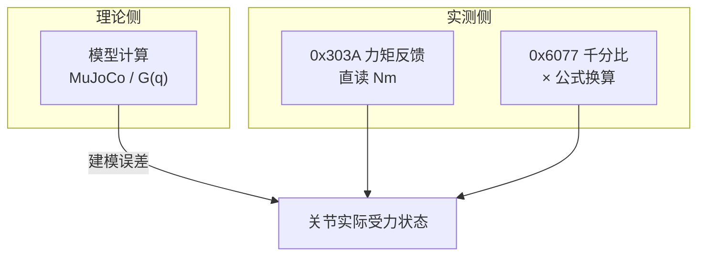

# 机械臂力矩测试总结

<p align="center"><em>双臂 7 轴 · 模型 / 0x303A / 0x6077 三线对比</em></p>

| 项目 | 内容 |
|:-----|:-----|
| **文档版本** | `v0.1` 初稿 |
| **编写日期** | 2026-06-20 |
| **沟通节点** | 2026-06-23（周二）节后对齐结论与发布范围 |
| **适用范围** | 双臂 7 轴机械臂（左臂 master0 / 右臂 master1） |

> [!abstract] 一页摘要
> - **力矩反馈** = `0x303A`，monitor「力矩」列，已是 Nm。
> - **电流反馈** = `0x6077` 千分比经 `101 × T_rated / 1000` 换算，不是另读电流表。
> - **1、2 轴**大负载下换算与模型偏差 < 5%；**4、6 轴**两通道均系统性高于模型，优先改动力学模型。

<details>
<summary><strong>📑 目录</strong>（点击展开）</summary>

- [[#1. 背景与目的|1. 背景与目的]]
- [[#2. 原理说明|2. 原理说明]]
- [[#3. 重要代码与命令|3. 重要代码与命令]]
- [[#4. 测试方法|4. 测试方法]]
- [[#5. 测试数据与分析|5. 测试数据与分析]]
- [[#6. 结论|6. 结论]]
- [[#7. 附录|7. 附录]]
- [[#8. 节后沟通议题（2026-06-23）|8. 节后沟通议题]]

</details>

---

## 1. 背景与目的

### 1.1 背景

机械臂在静态持位时，各关节需输出一定力矩以平衡重力及负载。为验证**动力学模型**、**驱动器力矩通道**与**电流环估算**的一致性，在 MuJoCo 仿真与实机同步姿态下，对各轴进行力矩对比测试。

### 1.2 测试目的

1. 明确「模型计算」「电流反馈」「力矩反馈」三种数据的定义与换算关系。
2. 评估各轴在 5 kg / 3 kg / 无负载条件下的力矩偏差。
3. 为后续碰撞检测、力控、标定与建模改进提供依据。

### 1.3 验收口径（建议）

> [!tip] 采样条件
> 静态持位 · 速度接近 0 · 姿态与仿真一致后再采样。

| 关节类型 | 验收依据 | 良好标准 |
|----------|----------|----------|
| 大关节（1、2 轴） | 6077 换算 vs 模型 | 偏差 **< 5%** |
| 中小关节（3～6 轴） | **0x303A 力矩反馈** | 6077 换算作交叉验证 |

---

## 2. 原理说明

### 2.1 三种力矩来源

| 名称 | 来源 | 物理含义 |
|------|------|----------|
| **模型计算** | MuJoCo / 动力学模型 | 理论关节力矩（重力、惯性等；是否含摩擦取决于 URDF/模型配置） |
| **力矩反馈** | EtherCAT `0x303A` | 驱动器力矩通道直读，RT 层已转换为 **Nm** |
| **电流反馈** | EtherCAT `0x6077` + 公式换算 | 电流环给出的**相对额定扭矩千分比**，经减速比换算为关节力矩 **Nm** |

三者测的是同一关节在持位状态下的受力，但数据链路与标定不同，故不会完全一致。

### 2.2 数据链路关系



### 2.3 电流反馈换算公式

> [!important] 核心公式
>
> $$\tau_{joint} = R \times T_{rated} \times \frac{permille_{6077}}{1000}$$
>
> 即：**关节力矩 (Nm) = 减速比 × 额定扭矩 (Nm) × 0x6077 千分比 / 1000**

| 符号 | 说明 |
|------|------|
| 减速比 | 谐波减速器减速比，本机各轴均为 **101** |
| 额定扭矩 | **电机轴**额定扭矩（见 §7.1 电机参数表），非关节侧额定 |
| 0x6077 千分比 | CiA402 对象 `0x6077 Torque actual`，单位 ‰（1000 = 100% 额定扭矩） |

关节侧最大额定力矩：

```
τ_joint_max = T_rated × 101
```

**验算示例（1 轴，5 kg 负载）：**

- 电机 TCHL_25，`T_rated = 1.68 Nm`
- 实测换算力矩 `67.872 Nm`
- 反推千分比：`67.872 × 1000 / (101 × 1.68) ≈ 401‰`（约 40% 额定，合理）

### 2.4 monitor.py 中的两列力矩

`monitor.py` 实时打印与上述定义一致：

| 显示列 | 寄存器 | 含义 |
|--------|--------|------|
| `力矩` | `0x303A` | 已是 Nm，即**力矩反馈** |
| `0x6077` | `0x6077` | 千分比 ‰，代入 §2.3 公式得**电流反馈** |

> [!warning] 命名说明
> 本系统中的「电流反馈」**并非**单独读一路电流表，而是由 **0x6077 千分比 + 额定扭矩 + 减速比** 估算的关节力矩。

### 2.5 力矩反馈与电流反馈的理想关系

在静态持位、标定正确、无显著摩擦建模误差时：

```
力矩反馈 (0x303A) ≈ 电流反馈 (6077 换算) ≈ 模型计算
```

实际偏差来源：

1. **摩擦 / 线缆拉力**：未完全进入模型 → 反馈大于模型。
2. **额定扭矩 / 减速比标定误差** → 仅 6077 换算偏差，0x303A 仍准。
3. **传动效率**：6077 反映电机侧输入，0x303A 在输出侧测量 → 一般 |换算值| ≥ |输出力矩|。
4. **多轴耦合**：某一轴电流/力矩受其它轴影响。
5. **零偏**：空载时力矩应接近 0 但不为 0 → 需零偏校准（§4.3）。

---

## 3. 重要代码与命令

### 3.1 轴号与 EtherCAT 从站映射

| 轴 | 从站 `-p` | 电机型号 | 额定扭矩 (Nm) |
|----|-----------|----------|---------------|
| 1 轴 | 0 | TCHL_25 | 1.68 |
| 2 轴 | 1 | TCHL_25 | 1.68 |
| 3 轴 | 2 | TCHL_20 | 0.84 |
| 4 轴 | 3 | TCHL_20 | 0.84 |
| 5 轴 | 4 | TCHL_20 | 0.84 |
| 6 轴 | 5 | TCHL_17 | 0.60 |
| 7 轴 | 6 | TCHL_17 | 0.60 |

主站 `-m`：`0` = 左臂（master0），`1` = 右臂（master1）。

### 3.2 实时监控（推荐）

```bash
# 右臂 7 轴，1 Hz 刷新，打印一帧后退出
python3 /opt/project/motor_servo/scripts/monitor.py --shm /shm_right_arm7 --hz 1 --once

# 左臂
python3 /opt/project/motor_servo/scripts/monitor.py --shm /shm_left_arm7 --hz 1 --once
```

**输出示例（节选）：**

```
  轴      位置          速度       力矩    0x6077    状态字  ...
   0      +xx.xxx°    +x.xxx°/s   67.87Nm   +401‰   ...
```

- **力矩反馈**：读 `力矩` 列（Nm）。
- **电流反馈**：用 `0x6077` 列代入 §2.3 公式，或在表格中批量计算。

### 3.3 EtherCAT 直读力矩（0x303A）

```bash
# 右臂 1 轴示例（-p 0）
sudo /usr/local/etherlab/bin/ethercat -m 1 -p 0 -t int32 upload 0x303A 0x00

# 右臂 3 轴示例（-p 2）
sudo /usr/local/etherlab/bin/ethercat -m 1 -p 2 -t int32 upload 0x303A 0x00
```

参数说明：

- `-m`：主站（`0` 左臂，`1` 右臂）
- `-p`：从站 ID（见 §3.1，**按轴填写，非固定值**）

返回值经 RT/驱动器解析后与 `monitor.py` 的 `力矩` 列一致（Nm）。

### 3.4 实机摆姿态（同步仿真）

MuJoCo 中读取各 `joint` 弧度并转换为角度（°），写入 7 个关节的绝对路点。

**左臂：**

```bash
cd /opt/project/motor_servo

python3 scripts/stability_left_test.py \
  -c config/dual_left_arm_master0_7dof.yaml \
  --shm /shm_left_arm7 \
  --point-a-deg '0,54.95,0,-60.73,0,0,0' \
  --rounds 0
```

**右臂：**

```bash
python3 scripts/stability_right_test.py \
  -c config/dual_right_arm_master1_7dof.yaml \
  --shm /shm_right_arm7 \
  --point-a-deg '<7个关节角度，逗号分隔，单位°>' \
  --rounds 0
```

脚本通过 Ruckig 规划 + 共享内存 dense 轨迹，将机械臂运动到与仿真一致的姿态；到位后静止 **≥ 0.5 s** 再读力矩。

### 3.5 monitor.py 核心打印逻辑（摘录）

路径：`/opt/project/motor_servo/scripts/monitor.py`

```python
# 各轴状态表头
header = f"  {'轴':>4}  {'位置':>10}  {'速度':>9}  {'力矩':>7}  {'0x6077':>8}  ..."

for i in range(snap.axis_count):
    ax = snap.axes[i]
    print(f"  {ax.axis_id:>4}"
          f"  {math.degrees(ax.position):>+9.3f}°"
          f"  {math.degrees(ax.velocity):>+8.3f}°/s"
          f"  {ax.torque:>6.2f}Nm"              # 0x303A，力矩反馈
          f"  {ax.torque_actual_permille:>+7d}‰" # 0x6077，千分比
          ...)
```

文件头注释：

```text
实时打印所有轴的位置、速度、力矩（0x303A Nm + 0x6077 千分比）、状态
```

### 3.6 空载力矩偏大 — 零偏校准

若**空载、未受力**时力矩反馈仍明显不为 0，可对应当手臂、对应从站写入力矩通道零偏（示例：左臂 6 轴，`-p 5`）：

```bash
sudo /usr/local/etherlab/bin/ethercat -m 0 download -p 5 -t uint16 0x3801 0x00 10
```

说明：

- 针对 **力矩反馈通道（0x303A）** 零偏；末尾 `10` 为现场调试示例值，**非固定常数**。
- 若仅 6077 换算偏大、0x303A 正常，应检查电流环零偏或 YAML 中额定扭矩配置。

---

## 4. 测试方法

### 4.1 环境准备

| 项 | 要求 |
|----|------|
| 仿真 | `mujoco-3.6.0-windows-x86_64\bin/simulate.exe` |
| 模型 | `assets/5KGarm.urdf`（5 kg 负载配置） |
| 实机 | RT 进程运行中，对应 SHM 可用（`/shm_left_arm7` / `/shm_right_arm7`） |
| 供电 | 44 V～59 V（见电机参数表） |

### 4.2 测试流程


**步骤详解：**

1. **启动仿真**：运行 `simulate.exe`，拖入 `5KGarm.urdf`，点击 **Pause → Reset** 归零。
2. **调整测试姿态**：按待测关节，将机械臂摆到该轴**重力矩最大**的姿态（各轴姿态见测试记录附图）。
3. **记录关节角**：在仿真中读取 `joint` 节点弧度，转换为角度（°），共 7 个值。
4. **实机运动**：使用 `stability_left_test.py` / `stability_right_test.py`，`--point-a-deg` 填入上述角度。
5. **读数**：到位静止后执行 `monitor.py --once`，记录目标轴的 `力矩` 与 `0x6077`；按需用 EtherCAT 直读复核。
6. **换算电流反馈**：`τ = 101 × T_rated × permille / 1000`。
7. **对比模型**：记录 MuJoCo / 动力学算出的同姿态理论力矩。

### 4.3 负载工况

| 工况 | 说明 |
|------|------|
| 右臂 5 kg | 仿真 URDF 带 5 kg 末端负载，右臂测试 |
| 左臂 5 kg | 同上，左臂 |
| 右臂 3 kg | 3 kg 负载配置 |
| 左臂 3 kg | 3 kg 负载配置 |
| 无负载 | 空载 URDF / 无末端负载 |

### 4.4 数据记录表模板

| 轴 | 负载 | 臂 | 模型 (Nm) | 6077 (‰) | 电流反馈 (Nm) | 力矩反馈 (Nm) | 偏差说明 |
|----|------|-----|-----------|----------|---------------|---------------|----------|
| 1 | 5kg | 右 | | | | | |
| … | | | | | | | |

电流反馈 (Nm) = `101 × T_rated × 6077 / 1000`

---

## 5. 测试数据与分析

### 5.1 1 轴

| 工况 | 模型 (Nm) | 电流反馈 (Nm) | 力矩反馈 (Nm) | 备注 |
|------|-----------|---------------|---------------|------|
| 右臂 5kg | 68.1 | 67.872 | — | 偏差约 0.3% |
| 左臂 5kg | 68.1 | −67.872 | — | 符号相反，左右对称 |
| 右臂 3kg | 54.379 | 54.636 | — | 良好 |
| 左臂 3kg | 54.379 | 36.311 | — | **偏差较大，需复测** |
| 右臂无负载 | 33.80 | 34.954 | — | 良好 |
| 左臂无负载 | 33.80 | 36.311 | — | 略偏高 |

**分析**：大负载下右臂与模型高度一致；左臂 3 kg 单点异常，建议复测姿态与采样时刻。

### 5.2 2 轴

| 工况 | 模型 (Nm) | 电流反馈 (Nm) | 力矩反馈 (Nm) | 备注 |
|------|-----------|---------------|---------------|------|
| 右臂 5kg | −68.105 | −67.872 | — | 良好 |
| 左臂 5kg | −68.105 | −65.157 | — | 良好 |
| 右臂 3kg | −54.3846 | −55.485 | — | 良好 |
| 左臂 3kg | −54.3846 | −51.073 | — | 可接受 |
| 右臂无负载 | 33.80 | 33.766 | — | 极好 |
| 左臂无负载 | 33.80 | 30.033 | — | 可接受 |

**分析**：2 轴与 1 轴类似，大关节标定可靠，6077 换算可用于在线监测。

### 5.3 3 轴

| 工况 | 模型 (Nm) | 电流反馈 (Nm) | 力矩反馈 (Nm) | 备注 |
|------|-----------|---------------|---------------|------|
| 5kg | 34.648 | 36.14 | 35.86 | 三者接近 |
| | | −33.94 | — | |
| | | −38.09 | −34.18 | |
| 3kg | 25.779 | 24.6 | 27.13 | 力矩反馈略高 |
| | | −25.33 | — | |
| | | −28.93 | −25.77 | |
| 无负载 | 12.475 | 14.337 | 13.01 | |
| | | −12.20 | — | |
| | | −12.81 | −12.68 | |

**分析**：3 轴具备双通道数据，力矩反馈整体更接近模型。

### 5.4 4 轴

| 工况 | 模型 (Nm) | 电流反馈 (Nm) | 力矩反馈 (Nm) | 备注 |
|------|-----------|---------------|---------------|------|
| 5kg | −35.00 | −43.44 | −42.43 | 反馈系统性偏高 |
| | −34.65 | −41.48 | −38.24 / −33.9 | |
| 3kg | −25.77 | −32.324 | −33.23 | |
| | −25.77 | −32.324 | −28.95 | |
| | −25.77 | −30.372 | −25.5 | 力矩接近模型 |
| 无负载 | −12.475 | −14.847 | −19.74 | 力矩偏差大 |
| | −12.475 | −14.847 | −13.28 | |
| | −12.475 | −13.32 | −12.29 | |

**分析**：电流与力矩反馈彼此接近，但均高于模型约 15%～40% → **优先检查模型（摩擦、质量、质心）**，非单纯公式问题。

### 5.5 5 轴

| 工况 | 模型 (Nm) | 电流反馈 (Nm) | 力矩反馈 (Nm) | 6077 (‰) | 备注 |
|------|-----------|---------------|---------------|----------|------|
| 5kg | 11.42 | 13.82 | 12.49 | — | 力矩更接近模型 |
| | −11.86 | −13.57 | −12.09 | −11.86 | |
| 3kg | 7.503 | 9.5 | 8.41 | — | 电流偏高 ~20% |
| | −7.85 | −9.25 | −8.05 | −7.85 | |
| 无负载 | 1.624 | 2.714 | 2.61 | — | |
| | −1.86 | −2.036 | −2.34 | −1.86 | |

**分析**：5 轴力矩反馈优于 6077 换算；电流反馈系统性偏高，可微调 `T_rated` 或摩擦参数。

### 5.6 6 轴

| 工况 | 模型 (Nm) | 电流反馈 (Nm) | 力矩反馈 (Nm) | 备注 |
|------|-----------|---------------|---------------|------|
| 5kg | −11.421 | −16.543 | −17.03 / −12.29 | 大负载偏差大 |
| | −11.421 | −14.968 | −11.93 | |
| 3kg | −7.502 | −10.423 | −13.17 / −7.7 | 不一致 |
| 无负载 | −1.622 | −2.3 | −7.51 | **异常点** |
| | −1.622 | −2.3 | −1.84 | 合理 |
| | −1.622 | −0.909 | −1.9 | 电流最接近模型 |

**分析**：6 轴小负载存在力矩反馈异常（−7.51 vs 模型 −1.62），需复测并确认 `-p 5`、姿态稳定；大负载偏差与 4 轴类似，倾向建模问题。

### 5.7 各轴小结

| 轴 | 6077 vs 模型 | 0x303A vs 模型 | 一致性 | 建议 |
|:--:|:------------:|:--------------:|:------:|:-----|
| **1** | 🟢 优 | 未全测 | — | 可用 6077 监测 |
| **2** | 🟢 优 | 未全测 | — | 可用 6077 监测 |
| **3** | 🟡 良好 | 更接近模型 | 🟢 | 验收以 0x303A 为主 |
| **4** | 🔴 系统性偏高 | 🔴 系统性偏高 | 🟢 | 改模型/摩擦 |
| **5** | 🟡 偏高 ~15% | 更接近模型 | 🟢 | 验收以 0x303A 为主 |
| **6** | 🟠 不稳定 | 🟠 不稳定 | 🟡 | 复测 + 改模型 |

---

## 6. 结论

### 6.1 数据定义结论

> [!info] 三种读数的定义
>
> | 读数 | 定义 |
> |------|------|
> | **力矩反馈** | `0x303A` → monitor「力矩」列，单位 Nm，**无需再乘减速比** |
> | **电流反馈** | `0x6077` 千分比 × `101 × T_rated / 1000`，非独立电流采样 |
> | **模型计算** | 仿真/动力学理论值；无负载仍 ~33.8 Nm 时需与建模对齐语义 |

### 6.2 测试结论

> [!success] 主要结论
>
> 1. **1、2 轴（TCHL_25）**：大负载下 6077 换算与模型偏差 **< 5%**，`T_rated=1.68 Nm`、减速比 101 可信。
> 2. **3、5 轴（TCHL_20）**：0x303A 更接近模型；6077 不宜单独作验收依据。
> 3. **4、6 轴**：两通道彼此接近但均高于模型 → **动力学模型或摩擦不足**。
> 4. **6 轴**小负载存在离群点，需复测后再定稿。
> 5. **空载零偏**：力矩明显不为 0 时用 `0x3801` 校准后重测。

### 6.3 后续建议

| 优先级 | 事项 | 责任建议 |
|--------|------|----------|
| P0 | 左臂 1 轴 3 kg 单点复测 | 测试 |
| P0 | 6 轴小负载异常点复测 | 测试 |
| P1 | 4、6 轴 URDF 摩擦 / 质量 / 质心校对 | 建模 |
| P1 | 无负载模型 ~33.8 Nm 语义对齐（是否含等效负载） | 建模 + 测试 |
| P2 | 5 轴 6077 换算系数微调或 YAML `T_rated` 核对 | 控制 |
| P2 | 建立标准测试姿态库 + 自动化记录脚本 | 控制 |

---

## 7. 附录

### 7.1 电机型号参数表

| 轴 | 型号 | 额定电流 (A) | 额定扭矩 (Nm) | 最大过载 | 功率 |
|----|------|--------------|---------------|----------|------|
| 1、2 | TCHL_25 | 18 | 1.68 | 2× | 530 W |
| 3、4、5 | TCHL_20 | 7.08 | 0.84 | 2× | 270 W |
| 6、7 | TCHL_17 | 5.4 | 0.60 | 2× | 190 W |

其他型号（本机未用）：TCHL_11 (0.12 Nm)、TCHL_14 (0.16 Nm)、TCHL_32 (2.7 Nm)。

供电电压：**44 V～59 V**。

### 7.2 命令速查

```bash
# 监控（左/右臂）
python3 /opt/project/motor_servo/scripts/monitor.py --shm /shm_left_arm7 --hz 1 --once
python3 /opt/project/motor_servo/scripts/monitor.py --shm /shm_right_arm7 --hz 1 --once

# 力矩直读（右臂 N 轴，-p = 轴号 - 1）
sudo /usr/local/etherlab/bin/ethercat -m 1 -p <N-1> -t int32 upload 0x303A 0x00

# 零偏校准（左臂 6 轴示例）
sudo /usr/local/etherlab/bin/ethercat -m 0 download -p 5 -t uint16 0x3801 0x00 10
```

### 7.3 6077 换算 Excel / Python 公式

```python
def torque_from_6077(permille: int, rated_torque_nm: float, ratio: int = 101) -> float:
    return ratio * rated_torque_nm * permille / 1000.0

# 1 轴示例：401‰, TCHL_25
torque_from_6077(401, 1.68)  # ≈ 67.87 Nm
```

### 7.4 变更记录

| 日期 | 版本 | 说明 |
|------|------|------|
| 2026-06-20 | v0.1 | 初稿：原理、代码、方法、1～6 轴数据与结论 |

---

## 8. 节后沟通议题（2026-06-23）

1. 4、6 轴模型偏差是否纳入当前版本已知问题？
2. 验收报告以 **0x303A** 还是 **6077 换算** 为签字依据？
3. 是否补充 7 轴数据、是否统一左右臂测试表格格式？
4. 文档定稿与对外发布范围。
