# 物料出入库管理系统 — 架构设计文档

> **文档状态**：草案 v1.1（组合方案已定稿）  
> **最后更新**：2026-06-15  
> **维护方式**：每次架构/技术决策变更后，更新对应章节并在文末「变更记录」追加条目

---

## 1. 文档说明

### 1.1 目的

本文档描述系统的技术架构、组件划分、数据流、部署方式与集成方案，为实施与运维提供技术依据。

### 1.2 关联文档

- [产品设计文档](./产品设计文档.md)
- [开发过程实录（飞书）](https://zcnce50wan15.feishu.cn/docx/YJ4iduq3ToSma8xzuvuci9BlnJg) — 2026-06-10 决策演进与分享素材
- [AGENTS.md](../AGENTS.md) — 开发约定入口
- [.cursor/rules/stock-project-conventions.mdc](../.cursor/rules/stock-project-conventions.mdc) — Cursor 强制规则

### 1.3 架构决策摘要（ADR）

| 决策项 | 结论 | 理由 |
|--------|------|------|
| 数据存储 | 飞书多维表格（Bitable）**唯一数据源** | 零运维 DB，维护人可直接查表纠错 |
| 应用形态 | **飞书网页应用**嵌入工作台 | [官方接入指南](https://open.feishu.cn/document/embed-web-app-into-feishu-workbench/introduction)；桌面/移动统一入口 |
| 前端 | 轻量 **H5（React）** | 定制入库/出库/搜索体验；可调飞书 JSAPI（扫码） |
| 后端 | 轻量 **FastAPI** | 免登、JSAPI 鉴权、Bitable API 封装、出入库业务与角色校验 |
| 库存变更 | 后端 API 写流水并更新 inventory | 逻辑集中、易校验；Bitable 自动化可作备用 |
| 权限 | 飞书群组角色 + API 鉴权 + Bitable 高级权限 | 身份用飞书，数据层兜底 |
| 复用策略 | **组合方案**（§3.4）：Erniu/官方模板 + lark-samples + 薄自研 | 避免重复造轮子 |
| 可选增强 | Erniu 机器人；Bitable 应用模式（库管备用） | 非 MVP |
| 缓存/消息队列 | 不需要 | 低并发 |
| 独立数据库 | 不需要 | Bitable 即数据源 |

---

## 2. 系统上下文

### 2.1 上下文图（C4 Level 1）

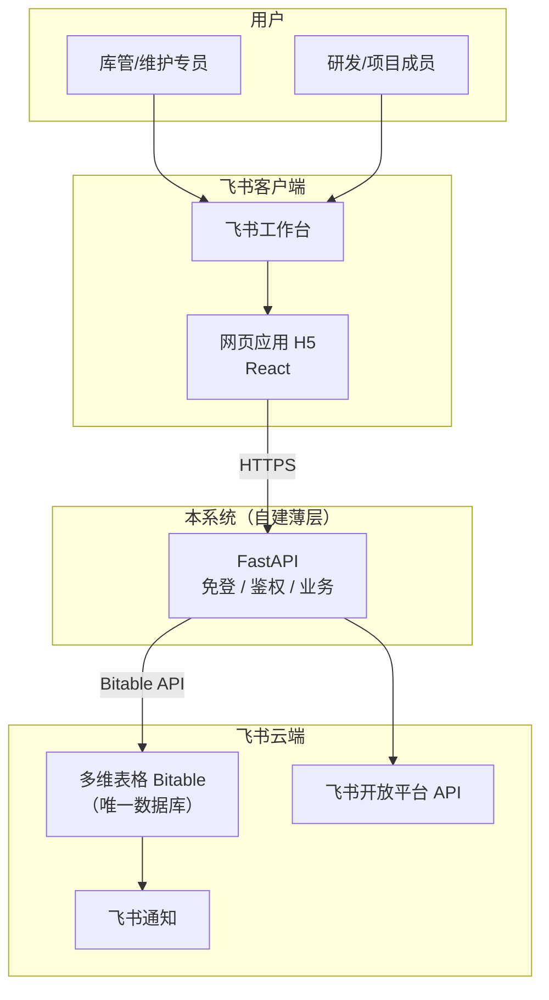

### 2.2 系统边界

**系统内（MVP）：**

- 飞书多维表格（5 张核心数据表）
- 飞书自建应用 — **网页应用**（工作台入口）
- H5 前端（React）：搜索、入库、出库、物料详情
- FastAPI 后端：免登、JSAPI 鉴权、Bitable CRUD、出入库业务、角色校验
- Bitable 高级权限（数据层兜底）

**系统外（不纳入 MVP）：**

- 独立 PostgreSQL / MySQL / Redis
- 完整 ERP、采购/财务系统
- Erniu 机器人（可选增强）
- 多维表格「应用模式」作为主界面（仅可作库管备用）

---

## 3. 架构方案对比

### 3.1 三档方案评估

| 方案 | 架构 | 匹配度 | 稳定性 | 运维成本 | 结论 |
|------|------|--------|--------|---------|------|
| **A. Bitable + 飞书网页应用** | Bitable + H5 + FastAPI | ⭐⭐⭐⭐⭐ | ⭐⭐⭐⭐ | 低 | **MVP 采用** |
| B. 官方模板 + 应用模式 | Bitable + 应用模式 | ⭐⭐⭐⭐ | ⭐⭐⭐⭐⭐ | 极低 | 库管备用 / 快速验证 |
| C. Erniu 开源 | Bitable + 机器人 | ⭐⭐⭐⭐ | ⭐⭐⭐⭐ | 低 | 可选增强 |
| D. InvenTree | 独立 Docker | ⭐⭐⭐ | ⭐⭐⭐⭐⭐ | 中 | 未来规模化 |
| E. 若依WMS 等 | Java 企业 WMS | ⭐⭐ | ⭐⭐⭐⭐ | 高 | **不采用** |

### 3.2 当前选定架构

**方案 A（组合实现）**：Bitable（库）+ 飞书网页应用（面）+ FastAPI（薄业务层）。

**不自研部分**：Bitable 表（fork 模板）、飞书免登/JSAPI（fork lark-samples）。  
**自研部分**：4 个 H5 页面 + 8 个 API + 角色校验（见 §3.4、§4.3）。

### 3.3 调研结论：是否在重复造轮子？（2026-06-10）

#### 3.3.1 调研范围

| 类别 | 代表 | 与 MVP 关系 |
|------|------|------------|
| 飞书零代码 | [官方进销存模板](https://www.feishu.cn/content/article/7582519149600017604)、[应用模式实践](https://duntools.com/inventory-management-with-feishu/) | 功能最全、零开发；**无工作台 H5** |
| 飞书开源库存 | [Erniu](https://github.com/dyue708/Erniu-Inventory-management-AI-agent) | **唯一**「Bitable + 出入库」成品；机器人/卡片，非 H5 |
| 飞书官方脚手架 | [lark-samples](https://github.com/larksuite/lark-samples)（`web_app_quick_start`、`react_and_nodejs/web_app`） | 免登 + JSAPI 已实现；**无库存业务** |
| Bitable API 样板 | dataTracker_excel、Feishu_API_Navs | 仅 API/读表样板 |
| 脱离飞书 | [Teable](https://github.com/teableio/teable)、InvenTree、若依WMS | 需换数据库/生态，**违背当前约束** |

#### 3.3.2 结论（直接回答）

| 做法 | 是否造轮子 | 说明 |
|------|-----------|------|
| 从零写 FastAPI 免登 + JSAPI 鉴权 | **是** | 应用 [lark-samples](https://github.com/larksuite/lark-samples) 或[官方 quick start](https://open.feishu.cn/document/home/quickly-develop-a-web-app-nodejs/step-2-download-and-run-sample-code) |
| 从零设计 Bitable 五表 | **部分是** | 用 [Erniu 模板](https://ccn1hpzj4iz4.feishu.cn/base/DyAYb1D2RaYcbQsjdsdcZOEOnad) 或官方库存模板，按 PRD 改字段 |
| 从零写出入库业务规则 | **部分是** | 可参考 [Erniu](https://github.com/dyue708/Erniu-Inventory-management-AI-agent) 入库/出库写表逻辑（去掉 AI、利润） |
| 从零写 H5 全套 UI 组件库 | **是** | 用简单 UI 库 + 3 个业务页即可，不必做「后台系统」 |
| 坚持工作台 H5 + 不用任何成品 | **整体偏造轮子** | 无「Bitable + 工作台 H5 库存」一体化开源成品 |

**不存在**「fork 即用、且满足 Bitable + 飞书工作台网页应用 + 实验室物料 + 三角色」的单一开源项目。

#### 3.3.3 组合方案概要（**已决为 MVP 实施方式**，详见 §3.4）

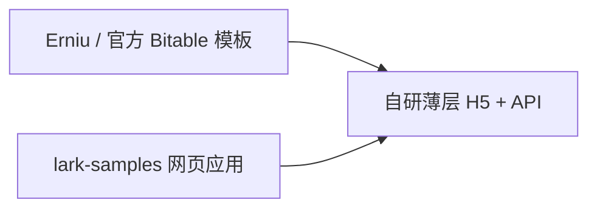

**预估工期**：全从零 2～3 周 → 组合方案 **约 1 周**。

#### 3.3.4 若可调整「必须工作台 H5」

| 方案 | 开发量 | 体验 |
|------|--------|------|
| **仅应用模式**（[半小时级实践](https://duntools.com/inventory-management-with-feishu/)） | 最少 | 在多维表格内操作，非独立 H5 |
| **Erniu 卡片/机器人**（关 AI） | 1～2 天部署 | 飞书内对话/卡片出入库，无自定义 H5 |

若产品坚持 [嵌入工作台 H5](https://open.feishu.cn/document/embed-web-app-into-feishu-workbench/introduction)，则 **§3.3.3 组合方案** 为当前调研下的最优解，而非退回全零代码。

#### 3.3.5 明确不采纳

- **Teable / 自建 PostgreSQL**：离开飞书 Bitable，维护两套系统
- **InvenTree / 若依WMS**：成熟但生态与 PRD 不符，迁移成本高
- **全栈从零**：重复实现飞书已提供的免登、JSAPI、Bitable SDK 样板

### 3.4 MVP 实施路径（组合方案，已决）

#### 3.4.1 三层拿来用 vs 自研

| 层 | 拿来用（fork/复制） | 自研（最小集） |
|----|-------------------|---------------|
| **数据** | [Erniu Bitable 模板](https://ccn1hpzj4iz4.feishu.cn/base/DyAYb1D2RaYcbQsjdsdcZOEOnad) 或[官方库存模板](https://www.feishu.cn/content/article/7582519149600017604) | 按 PRD §5.2 改分类、库位、物料字段；录入初始数据 |
| **飞书接入** | [lark-samples](https://github.com/larksuite/lark-samples) → `react_and_nodejs/web_app` 或 `web_app_with_auth/python` | 迁入本仓库；配置 App ID/Secret；[嵌入工作台](https://open.feishu.cn/document/embed-web-app-into-feishu-workbench/introduction) |
| **出入库逻辑** | 参考 [Erniu 源码](https://github.com/dyue708/Erniu-Inventory-management-AI-agent) 的 Bitable 读写（**去掉 AI、利润、加权出库**） | FastAPI `inbound` / `outbound` + 库存校验 + 写流水 |
| **界面** | lark-samples 的路由、免登、`h5sdk.config` 骨架 | 4 页：搜索、出库、入库、详情；按角色显隐 |

#### 3.4.2 Erniu 模板 → 本项目五表映射

| Erniu 表 | 本项目表 | 改造说明 |
|----------|---------|---------|
| PRODUCT | `materials` | 商品→物料；删利润相关字段 |
| WAREHOUSE | `locations` | 仓库→库位；增 type（货柜/货架/暂存） |
| INVENTORY_SUMMARY | `inventory` | 保留 quantity；禁止前端直改 |
| INBOUND | 入库写入 + `transactions` | 合并或保留独立入库表，流水统一进 transactions |
| OUTBOUND | 出库写入 + `transactions` | 同上 |
| （无） | `categories` | 新增；与 PRD 十二类分类对齐 |

> 若 Erniu 表结构与 PRD 差异大，以 **PRD 五表为准**，仅用 Erniu 作字段参考与 API 写法参考。

#### 3.4.3 推荐代码仓库结构

```
stock-test/
├── backend/                 # FastAPI（可参考 Erniu 的 bitable 封装）
│   ├── app/
│   │   ├── main.py
│   │   ├── auth/            # 从 lark-samples 迁入免登逻辑
│   │   ├── services/bitable.py
│   │   ├── services/inventory.py   # 参考 Erniu 出入库
│   │   └── routers/
│   └── .env.example
├── frontend/                # 从 lark-samples react 示例迁入
│   ├── src/pages/           # Search, Outbound, Inbound, Detail
│   └── src/utils/auth.ts    # 保留官方 JSAPI 鉴权
├── docs/
└── .cursor/rules/
```

#### 3.4.4 分阶段实施清单

| 阶段 | 任务 | 来源 | 工期 |
|------|------|------|------|
| **P0-1** | 复制 Erniu/官方 Bitable 模板到本组织 | 模板 fork | 0.5 天 |
| **P0-2** | 按 PRD 调整五表字段；录入分类、库位、样例物料 | 文档 §5、§8 | 0.5～1 天 |
| **P0-3** | 飞书开放平台创建自建应用，开启网页应用 + Bitable 权限 | 官方文档 | 0.5 天 |
| **P1-1** | 迁入 lark-samples 免登 + JSAPI，本地跑通 `/me` | lark-samples | 1～2 天 |
| **P1-2** | FastAPI 封装 Bitable CRUD（`lark-oapi`） | Erniu 参考 | 1～2 天 |
| **P1-3** | 实现 MVP API（§4.3，含物料快捷建档、库内移动）+ 群组角色校验 | 自研 | 2～3 天 |
| **P1-4** | H5 四页对接 API；入库页仅 KEEPER+ 可见 | 自研 | 2～3 天 |
| **P1-5** | 配置工作台主页 URL；联调免登（隧道可后置） | 官方文档 §7.5 | 0.5～1 天 |
| **P2** | JSAPI 扫码、快递暂存上架 | 自研 | 3～5 天 |

#### 3.4.5 开发约束（反造轮子）

| 禁止 | 必须 |
|------|------|
| 从零写 OAuth/免登/JSAPI 签名 | 从 lark-samples 复制并适配 |
| 从零设计 Bitable 表 | fork 模板后按 PRD 增量修改 |
| 实现完整 WMS/进销存/利润 | 仅 MVP：搜、入、出、查、流水 |
| 前端自建组件库/后台框架 | 简单 UI（如 Ant Design Mobile）+ 4 页 |

---

## 4. 逻辑架构（MVP）

### 4.1 分层视图

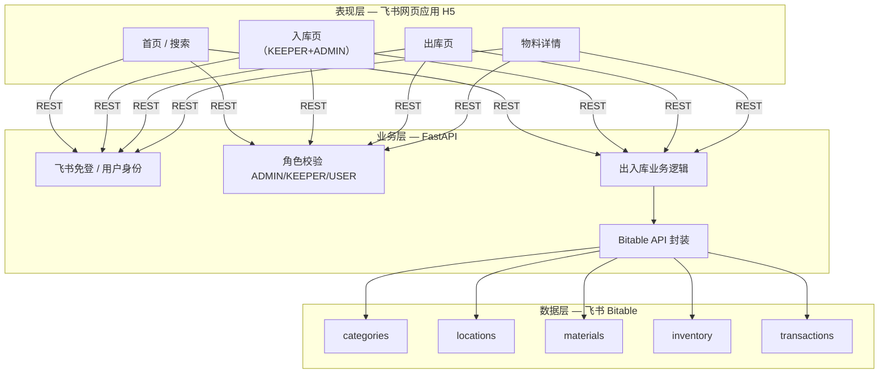

### 4.2 组件职责

| 组件 | 职责 | 技术 |
|------|------|------|
| 飞书工作台 | 统一入口，打开网页应用 | 自建应用 — [网页应用能力](https://open.feishu.cn/document/embed-web-app-into-feishu-workbench/introduction) |
| H5 前端 | 搜索、入库、出库、详情；按角色显隐页面 | React（**基于 lark-samples 迁入**）+ H5 SDK |
| FastAPI | 免登、JSAPI 签名、角色判断、出入库 API | Python 3.x + `lark-oapi`（Bitable 读写参考 Erniu） |
| Bitable | **唯一数据库**，存五表全量数据 | 飞书多维表格 Open API |
| Bitable 高级权限 | 数据层兜底，防绕过 API 手改库存 | 表/字段级只读 |
| Bitable 管理视图 | 库管直接维护主数据（可选） | 表格视图（非主操作入口） |

### 4.3 核心 API 清单（MVP）

| 方法 | 路径 | 角色 | 说明 |
|------|------|------|------|
| GET | `/auth/feishu/callback` | ALL | 免登 code 换用户身份 |
| GET | `/auth/jsapi-config` | ALL | JSAPI 鉴权参数 |
| GET | `/materials/search` | ALL | 分页搜索/浏览物料，支持 `q/page/size/stock_only`，主查询入口 |
| GET | `/materials/catalog` | ALL | 物料目录 + 各库位库存，保留给小数据/兼容场景 |
| GET | `/materials/categories` | ALL | 分类列表，供快捷新增物料选择 |
| POST | `/materials` | KEEPER, ADMIN | 新增物料主数据，入库页快捷建档 |
| GET | `/materials/{id}` | ALL | 物料详情 + 各库位库存 |
| GET | `/materials/{id}/transactions` | ALL | 最近流水 |
| GET | `/locations` | ALL | 库位列表，供入库/出库选择 |
| POST | `/inbound` | KEEPER, ADMIN | 入库 |
| POST | `/outbound` | ALL | 出库（USER 须填用途） |
| POST | `/transfer` | KEEPER, ADMIN | 库内移动/调拨，源库位 -N，目标库位 +N |
| GET | `/me` | ALL | 当前用户与角色 |

### 4.4 出入库时序（经后端）

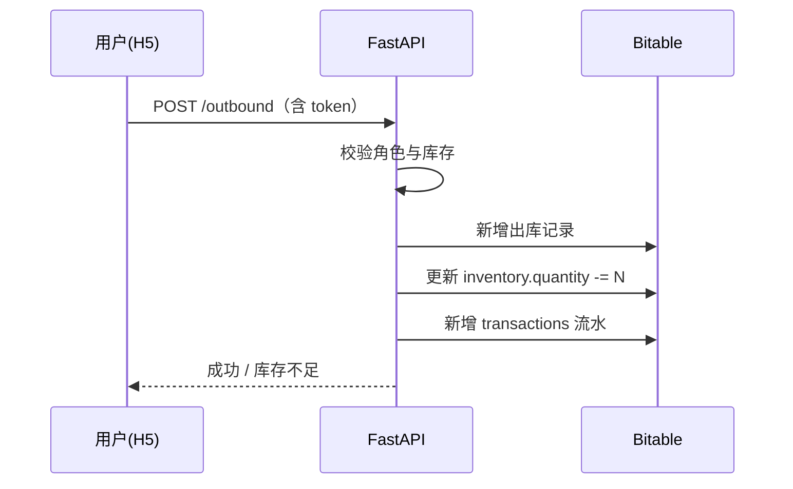

> 实现要求：出入库或库内移动若库存已更新但流水写入失败，后端需尝试回滚库存并返回错误，避免“库存变更无流水”。

---

## 5. 数据架构

### 5.1 表关系图

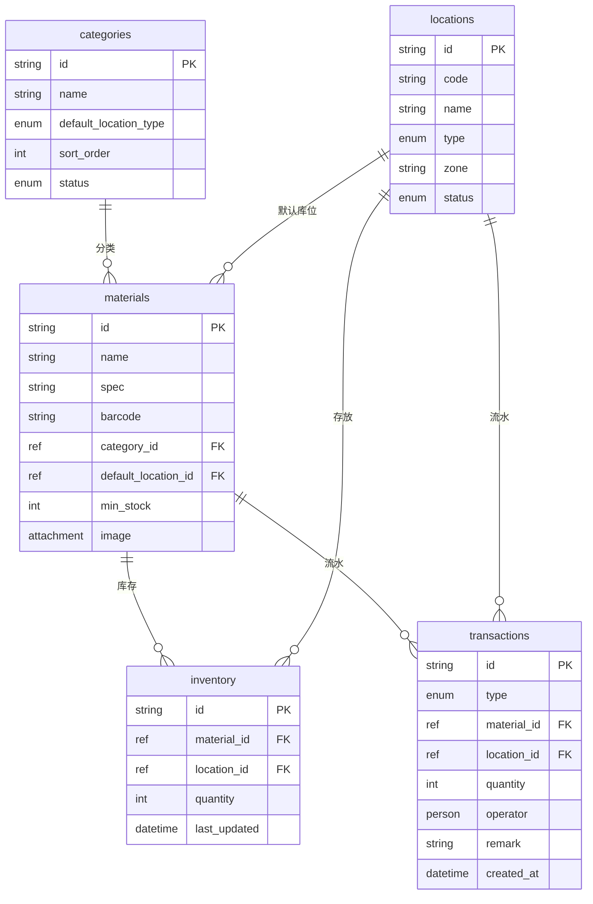

### 5.2 表字段明细

#### categories（物料分类表）

| 字段 | 类型 | 必填 | 说明 |
|------|------|------|------|
| category_id | 自动编号 | 是 | 主键 |
| name | 文本 | 是 | 如「电机模组」 |
| default_location_type | 单选 | 是 | 货柜/货架/专用架 |
| sort_order | 数字 | 否 | 排序 |
| status | 单选 | 是 | 启用/停用 |
| remark | 文本 | 否 | 备注 |

#### locations（库位表）

| 字段 | 类型 | 必填 | 说明 |
|------|------|------|------|
| location_id | 自动编号 | 是 | 主键 |
| code | 文本 | 是 | 如 A-柜-01 |
| name | 文本 | 是 | 显示名称 |
| type | 单选 | 是 | 货柜/货架/螺栓架/工具架/快递暂存 |
| zone | 文本 | 否 | 区域 |
| capacity | 数字 | 否 | 容量参考 |
| status | 单选 | 是 | 可用/已满/维护 |

#### materials（物料主数据表）

| 字段 | 类型 | 必填 | 说明 |
|------|------|------|------|
| material_id | 自动编号 | 是 | 主键 |
| name | 文本 | 是 | 物料名称 |
| category_id | 关联 | 是 | → categories |
| spec | 文本 | 否 | 规格型号 |
| unit | 文本 | 是 | 个/套/米 |
| barcode | 文本 | 否 | 扫码用 |
| default_location_id | 关联 | 否 | → locations |
| min_stock | 数字 | 否 | 安全库存 |
| image | 附件 | 否 | 物料图片 |
| status | 单选 | 是 | 启用/停用 |

#### inventory（库存表）

| 字段 | 类型 | 必填 | 说明 |
|------|------|------|------|
| inventory_id | 自动编号 | 是 | 主键 |
| material_id | 关联 | 是 | → materials |
| location_id | 关联 | 是 | → locations |
| quantity | 数字 | 是 | 当前数量 |
| last_updated | 日期时间 | 是 | 最后变更时间 |

> 约束：`(material_id, location_id)` 逻辑唯一。

#### transactions（出入库流水表）

| 字段 | 类型 | 必填 | 说明 |
|------|------|------|------|
| tx_id | 自动编号 | 是 | 主键 |
| type | 单选 | 是 | 入库/出库/移动/盘点调整 |
| material_id | 关联 | 是 | → materials |
| location_id | 关联 | 是 | → locations |
| quantity | 数字 | 是 | 正=入库，负=出库 |
| operator | 人员 | 是 | 飞书用户 |
| remark | 文本 | 否 | 用途/备注 |
| created_at | 创建时间 | 是 | 自动 |

### 5.3 库存变更策略（简化版）

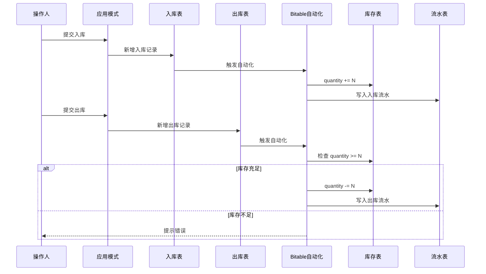

> **说明**：MVP 由 FastAPI 在写库前校验库存（见 §4.4）。低并发不实现乐观锁。Bitable 自动化仅作备用，非主路径。库内移动通过 FastAPI 同时更新源库位和目标库位，并追加移动流水。

---

## 6. 应用架构（可选增强：Erniu）

当需要飞书卡片/对话出入库时，叠加以下架构：

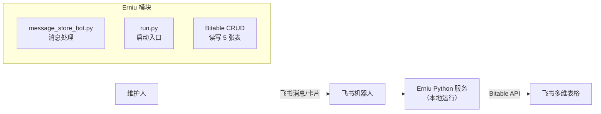

### 6.1 Erniu 集成要点

| 项 | 说明 |
|----|------|
| 开源地址 | https://github.com/dyue708/Erniu-Inventory-management-AI-agent |
| Bitable 模板 | https://ccn1hpzj4iz4.feishu.cn/base/DyAYb1D2RaYcbQsjdsdcZOEOnad |
| 运行方式 | 本地一台电脑 `python run.py` |
| 飞书权限 | bitable:app, im:message, cardkit:card:write 等 |
| AI 对话 | 可选（Deepseek），可关闭仅用卡片模式 |
| 改造点 | 商品→物料，仓库→库位，去掉利润计算 |

### 6.2 Erniu 表映射

| Erniu 表 | 本系统表 |
|----------|---------|
| WAREHOUSE | locations |
| PRODUCT | materials |
| INVENTORY_SUMMARY | inventory |
| INBOUND | transactions（入库） |
| OUTBOUND | transactions（出库） |

---

## 7. 部署架构

### 7.1 MVP 部署

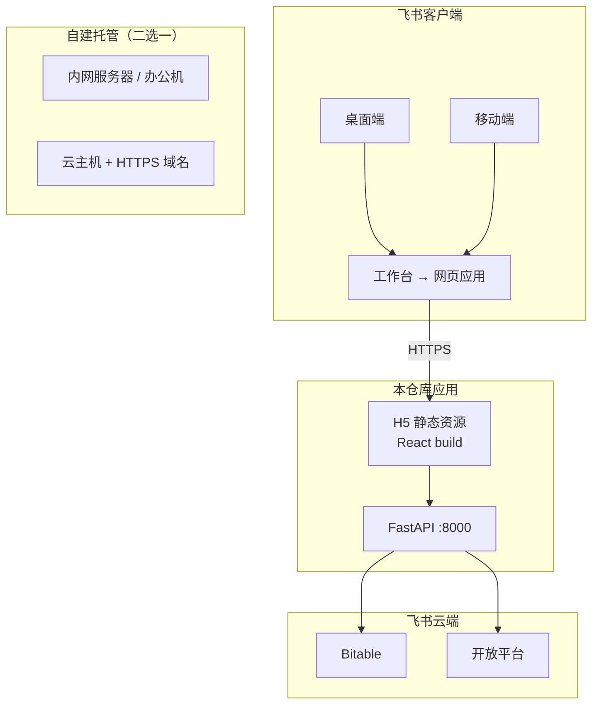

| 项 | 方案 |
|----|------|
| H5 访问地址 | 公网 HTTPS URL（飞书网页应用要求配置桌面端/移动端主页） |
| 后端 | FastAPI，与 H5 同域或 CORS 配置 |
| Bitable | 飞书云端，经 `tenant_access_token` 访问 |
| 配置 | `.env`：APP_ID、APP_SECRET、Bitable app_token、各 table_id |
| 运维 | 低访问量，单进程 + 反向代理（可选 Caddy/Nginx） |
| 备份 | 定期导出 Bitable；代码走 Git |

参考：[将网页应用嵌入飞书工作台](https://open.feishu.cn/document/embed-web-app-into-feishu-workbench/introduction)

### 7.2 飞书应用配置清单（MVP）

| 配置项 | 要求 |
|--------|------|
| 应用能力 | **网页应用** |
| 桌面端主页 | `https://<your-domain>/` |
| 移动端主页 | 同上（响应式 H5） |
| 重定向 URL | 免登回调地址 |
| 权限 scope | `bitable:app`、用户信息相关 scope |
| 可见范围 | 组织内 / 物料管理相关群组 |

### 7.3 增强部署（Erniu，可选）

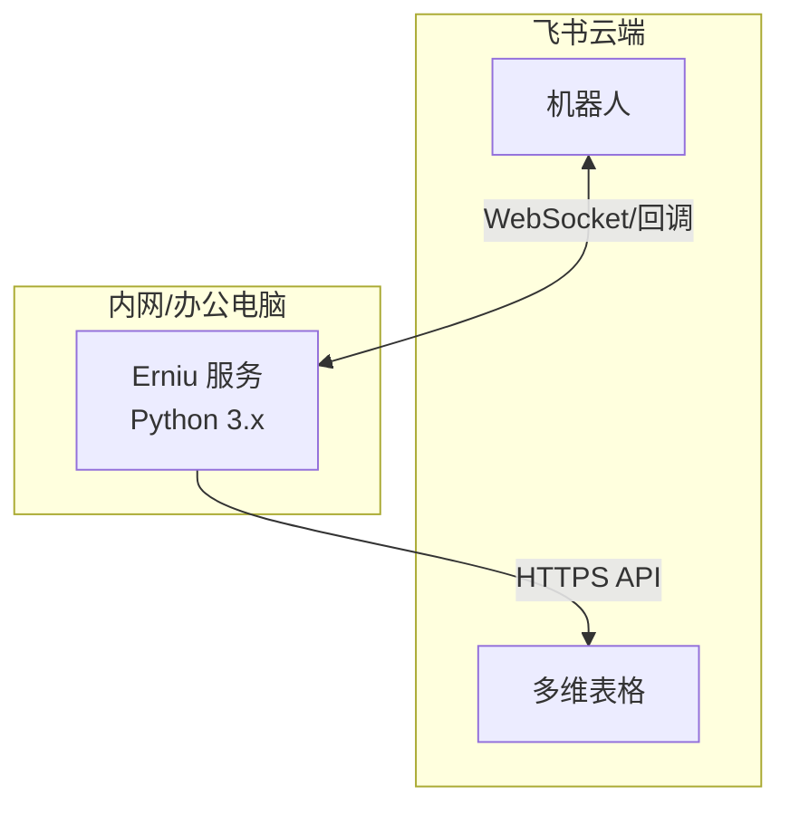

| 项 | 方案 |
|----|------|
| 运行环境 | 办公电脑或树莓派，长期开机 |
| 进程管理 | systemd / pm2 / nohup |
| 配置 | `.env` 存 App ID、Secret、table_id |
| 监控 | 日志文件 + 飞书异常通知 |

### 7.4 未来演进（参考）

若 Bitable 成为瓶颈，可引入 PostgreSQL 为主库，Bitable 作只读同步视图；或评估 InvenTree。

### 7.5 部署环境待定 — 对开发的影响

**结论：内网 / 公网方案可后置决策，不阻塞 Phase 0～1 开发。**

| 阶段 | 需要什么地址 | 不决定部署也能做？ |
|------|-------------|-------------------|
| Bitable 建表、录数据 | 无 | ✅ |
| FastAPI 业务 + Bitable API | 本机 `localhost` | ✅ |
| H5 页面开发 | 本机 Vite dev server | ✅ |
| 飞书免登 / JSAPI 联调 | 飞书能访问到的 **HTTPS URL** | ⚠️ 需临时方案，不必先定最终内网架构 |
| 工作台正式上架 | 稳定 HTTPS 主页 URL | ❌ 上线前必须确定 |

**开发期临时联调（任选，与最终内网方案无关）：**

- 本机 + 内网穿透（frp / ngrok 等）提供 HTTPS 域名
- 办公网一台机器部署预览版，飞书应用主页先指向该地址
- 浏览器直接打开 H5 调试 UI（免登可 mock，先跑通 API）

**最终内网常见做法（上线时再选）：**

- 公司内网服务器 + 内网 DNS + 企业 HTTPS 证书
- 或内网穿透/反向代理，使飞书客户端能打开 `https://stock.internal.xxx`

Bitable 在飞书云端，**与业务服务是否在内网无关**；后端只需能访问 `open.feishu.cn` API。

---

## 8. 集成设计

### 8.1 飞书工作台集成（MVP 主路径）

| 方式 | MVP | 说明 |
|------|-----|------|
| **网页应用嵌入工作台** | ✅ **主入口** | [接入教程](https://open.feishu.cn/document/embed-web-app-into-feishu-workbench/introduction) |
| 应用模式链接 | 备用 | 库管快速维护、灾备入口，非主界面 |
| 机器人 | 可选 | Erniu 方案 |

### 8.2 飞书开放平台配置

**应用能力**：网页应用（配置桌面端/移动端主页 URL）

**自建应用权限（最小集）：**

```json
{
  "tenant": [
    "bitable:app",
    "base:table:read",
    "base:table:update",
    "contact:user.base:readonly"
  ]
}
```

**网页应用必做流程：**

1. [嵌入工作台](https://open.feishu.cn/document/embed-web-app-into-feishu-workbench/introduction) — 配置主页 URL
2. [免登](https://open.feishu.cn/document/client-docs/h5/development-guide/basic-concepts) — `tt.requestAuthCode` → 后端换 `user_access_token`
3. [JSAPI 鉴权](https://open.feishu.cn/document/client-docs/h5/development-guide/basic-concepts) — `h5sdk.config` → 扫码等能力

**禁止**：前端直接持有 App Secret 或 `tenant_access_token`；所有 Bitable 写操作经后端。

### 8.3 外部系统

| 系统 | MVP | 说明 |
|------|-----|------|
| 采购系统 | 不集成 | 手动入库 |
| 财务系统 | 不集成 | — |
| ERP | 不集成 | — |

---

## 9. 安全与权限设计

> 产品侧角色定义与业务规则见 [产品设计文档 §3.3～§3.10](./产品设计文档.md)；使用场景与功能分层见 [§4](./产品设计文档.md)。

### 9.1 权限架构总览

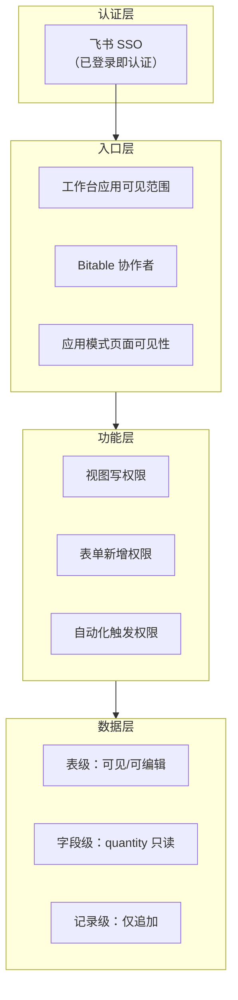

本系统 **不部署独立鉴权服务**。权限由飞书原生能力在三个层面叠加实现。

### 9.2 认证

| 项 | 方案 |
|----|------|
| 身份来源 | 飞书企业账号（`open_id` / 姓名） |
| 认证方式 | 用户已登录飞书 → 打开工作台应用即完成认证 |
| 操作人绑定 | 入库/出库表的「操作人」字段类型设为「人员」，默认当前用户 |
| 会话管理 | 由飞书客户端托管，无需自建 Token |

### 9.3 入口层权限

| 控制点 | 配置位置 | 配置值 |
|--------|---------|--------|
| 谁能看到工作台应用 | 飞书管理后台 → 应用可见范围 | `物料管理-全员` 群组成员 |
| 谁能打开多维表格 | Bitable → 分享 → 协作者 | 按角色群组分别授权 |
| 谁能打开网页应用 | 飞书应用可见范围 | 组织内 / 物料管理群组 |
| 外链分享 | 建议关闭 | 防止数据泄露到组织外 |

#### 协作者权限映射

| 角色 | 飞书群组 | Bitable 基础权限 | 说明 |
|------|---------|-----------------|------|
| ADMIN | 物料管理-管理员 | **可管理** | 含权限配置、结构变更 |
| KEEPER | 物料管理-库管 | **可编辑** | 配合高级权限收窄字段 |
| USER | 物料管理-全员 | **可阅读** | 配合指定视图开放写 |

### 9.4 功能层权限

通过 **H5 路由/按钮** + **FastAPI 鉴权** + **Bitable 高级权限** 三层控制：

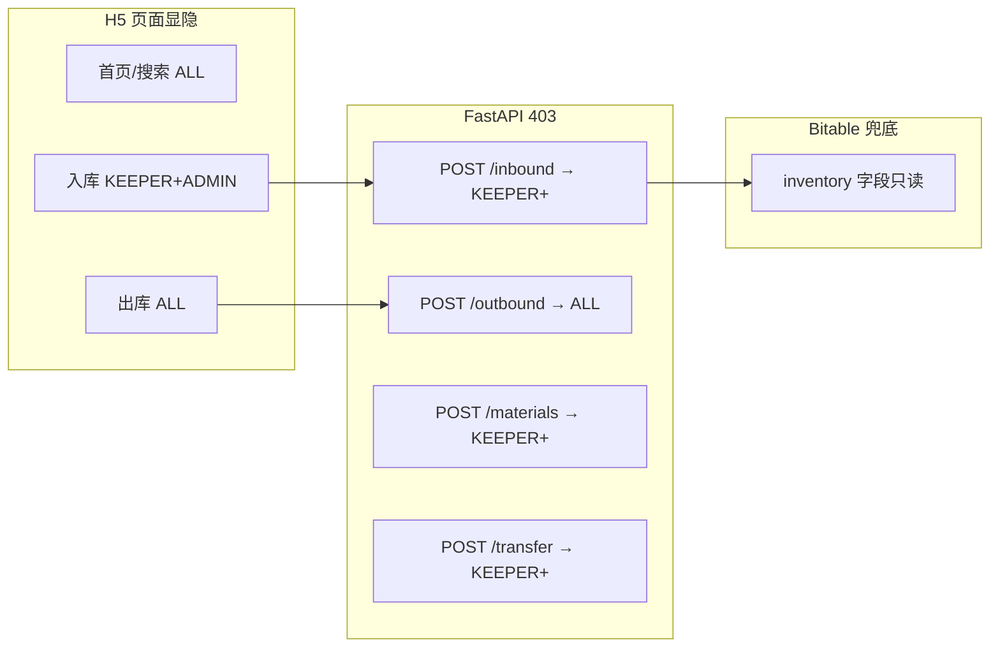

| 功能 | H5 | API | Bitable |
|------|----|-----|---------|
| 入库 | 隐藏入口（USER） | `POST /inbound` 校验角色 | 入库表写权限 |
| 出库 | 全员可见 | `POST /outbound` 校验库存 | — |
| 库内移动 | 隐藏入口（USER） | `POST /transfer` 校验角色与源库位库存 | inventory 字段只读 |
| 主数据维护 | 入库页支持快捷新增物料；批量维护仍走 Bitable 视图 | `POST /materials` 仅 KEEPER/ADMIN | 视图权限 |
| 库存纠错 | 无 | 仅 ADMIN 专用接口 | inventory 仅 ADMIN 可编辑 |

### 9.5 数据层权限（Bitable 高级权限）

#### 9.5.1 启用方式

```
多维表格 → 右上角「...」→ 高级权限 → 开启
→ 创建权限角色 → 关联飞书群组 → 按表/视图/字段配置
```

#### 9.5.2 权限角色配置

| Bitable 权限角色 | 关联群组 | 表权限概要 |
|-----------------|---------|-----------|
| `角色-管理员` | 物料管理-管理员 | 全部表：可管理 |
| `角色-库管` | 物料管理-库管 | 见下表 |
| `角色-用户` | 物料管理-全员 | 见下表 |

#### 9.5.3 按表细粒度配置

| 表 | 角色-库管 | 角色-用户 |
|----|----------|----------|
| categories | 可编辑 | 只读 |
| locations | 可编辑 | 只读 |
| materials | 可编辑 | 只读 |
| inventory | **只读**（全部字段） | **只读** |
| 入库表 | **可新增记录** | 不可见 / 只读 |
| 出库表 | **可新增记录** | **可新增记录** |
| transactions | 只读 | 只读 |

#### 9.5.4 字段级权限（关键）

| 表 | 字段 | 库管 | 用户 | 管理员 |
|----|------|------|------|--------|
| inventory | quantity | 只读 | 只读 | 可编辑 |
| inventory | material_id, location_id | 只读 | 只读 | 可编辑 |
| transactions | 全部 | 只读 | 只读 | 可编辑 |
| materials | 全部 | 可编辑 | 只读 | 可编辑 |

> **核心约束**：库存数字的变更 **只能** 通过「入库表/出库表 → 自动化 → 更新 inventory」链路完成。

### 9.6 库存变更权限链路

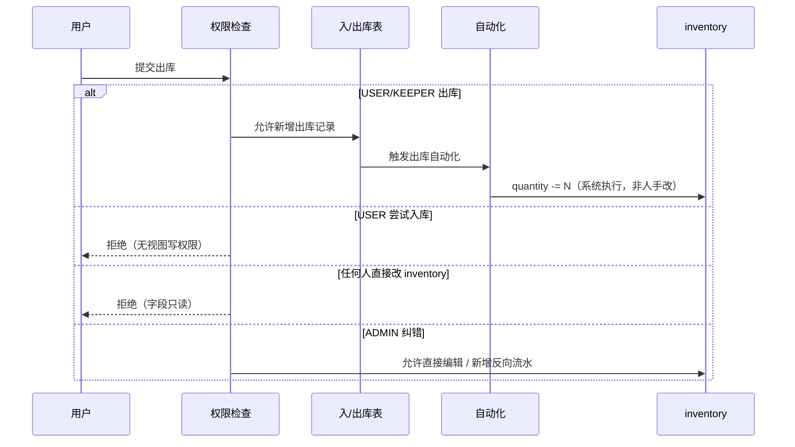

### 9.7 自动化规则的权限注意事项

| 自动化 | 执行身份 | 权限要求 |
|--------|---------|---------|
| 入库 → 库存 +N | 自动化以 **管理员身份** 或 **触发者身份** 执行 | 需确保自动化有权限写 `inventory` |
| 出库 → 库存 -N | 同上 | 同上 |
| 低库存通知 | 系统触发 | 通知库管群组 |

> **实施要点**：Bitable 自动化写 `inventory` 时，建议自动化创建者/维护者为 ADMIN，避免「用户触发了自动化但没有 inventory 写权限」导致执行失败。

### 9.8 审计设计

| 审计项 | 实现 |
|--------|------|
| 谁操作的 | 入/出库表「操作人」= 人员字段，默认当前用户 |
| 何时操作 | 创建时间字段自动记录 |
| 做了什么 | transactions 流水 + 入/出库原始记录 |
| 改了什么 | Bitable 记录修订历史（管理员可查） |
| 防篡改 | 流水表禁止删除；禁止非 ADMIN 修改已有流水 |
| 纠错 | ADMIN 新增反向流水，remark 注明 `纠错关联:tx_xxx` |

### 9.9 权限运维

| 场景 | 操作 |
|------|------|
| 新人入职 | 加入 `物料管理-全员` 群组 → 自动获得 USER 权限 |
| 库管交接 | 移出旧库管 → 加入新库管到 `物料管理-库管` |
| 人员离职 | 从所有物料管理群组移除 |
| 临时提权 | 短期加入库管群，到期移除 |
| 权限审计 | 每季度检查 Bitable 协作者列表 + 群组成员 |

### 9.10 可选增强：Erniu 机器人权限

若启用 Erniu，额外约束：

| 项 | 方案 |
|----|------|
| 谁能触发机器人 | 限制为库管群组成员（代码层校验 `open_id`） |
| 卡片操作权限 | 入库卡片仅库管可点；出库卡片全员可点 |
| API 凭证 | 使用 `tenant_access_token`，不暴露给前端 |
| 机器人配置 | 仅 ADMIN 可修改 `.env` 和部署 |

### 9.11 数据安全

- 敏感配置（App Secret）仅存 `.env`，不入库
- 关闭 Bitable 外链分享到组织外
- 定期复制 Bitable 副本做快照
- 流水表只追加，不删除

---

## 10. 可观测性

| 维度 | MVP 方案 |
|------|---------|
| 操作日志 | transactions 表 |
| 错误追踪 | FastAPI 日志 + Bitable API 响应 |
| 服务监控 | 进程存活 / 健康检查 `GET /health` |
| 告警 | 低库存：Bitable 自动化 → 飞书消息 |

---

## 11. 演进路线

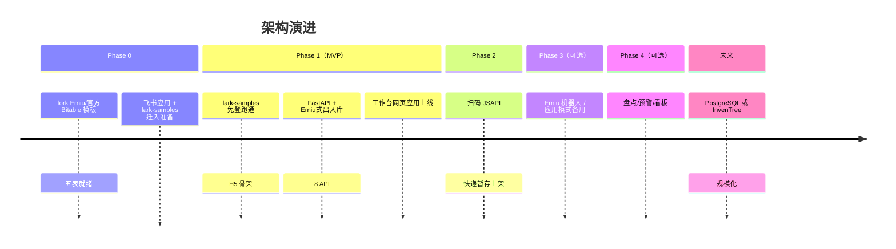

---

## 12. 技术栈总览

### 12.1 MVP 技术栈（组合方案）

| 层级 | 技术 | 来源 / 说明 |
|------|------|------------|
| 数据存储 | 飞书多维表格（Bitable） | **fork** [Erniu 模板](https://ccn1hpzj4iz4.feishu.cn/base/DyAYb1D2RaYcbQsjdsdcZOEOnad) 或官方库存模板 |
| 后端 | Python 3.x + FastAPI | 免登/JSAPI **迁入** lark-samples；出入库 **参考** Erniu |
| 飞书 SDK | `lark-oapi` | Bitable CRUD |
| 前端 | React + 飞书 H5 SDK | **基于** [lark-samples](https://github.com/larksuite/lark-samples) + 自研 4 业务页 |
| 身份认证 | 飞书免登 + 群组成员→角色 | 见 §9 |
| 通知 | 飞书消息（P2 低库存） | 可选 |
| 部署 | HTTPS 主机 + 工作台配置 | 见 §7.5，环境可后置 |

### 12.2 可选增强

| 组件 | 技术 |
|------|------|
| Erniu 机器人 | Python 本地服务 |
| Bitable 应用模式 | 库管备用界面 |
| Docker | 打包 FastAPI + 静态 H5 |

---

## 13. 待决技术事项

| # | 问题 | 影响 | 状态 |
|---|------|------|------|
| 1 | H5 + API 部署用内网还是云主机？ | 最终工作台主页 URL | **待定，不阻塞开发**；见 §7.5 |
| 2 | 角色判定：仅飞书群组 or Bitable 人员表？ | 鉴权实现 | 倾向飞书群组 |
| 3 | Erniu 模板字段是否需要改造？ | 决定 Phase 3 工作量 | 待定 |
| 4 | 是否需要独立备份策略？ | 运维 | 建议每周导出 |

---

## 变更记录

| 版本 | 日期 | 变更内容 | 来源 |
|------|------|---------|------|
| v0.1 | 2026-06-10 | 初稿：上下文图、逻辑架构、数据架构、部署方案、Erniu 增强路径、演进路线 | 飞书 Wiki + 三轮对话 + 方案调研 |
| v0.2 | 2026-06-10 | 扩展 §9 安全与权限设计：三层权限架构、Bitable 高级权限配置、审计、运维 | 权限管理讨论 |
| v0.3 | 2026-06-10 | §9 增加对产品文档 §4 使用场景的交叉引用 | 文档同步 |
| v0.4 | 2026-06-10 | §1.2 增加 AGENTS.md 与 Cursor 规则引用 | 项目规则约束 |
| v0.5 | 2026-06-10 | **MVP 技术路线变更**：Bitable + 飞书网页应用 + FastAPI；更新 §1.3/§2/§4/§7/§8/§9/§11/§12 | 用户确认 MVP 形态 |
| v0.6 | 2026-06-10 | 新增 §7.5：部署环境待定不阻塞开发 | 内网部署讨论 |
| v0.7 | 2026-06-10 | 新增 §3.3：重复造轮子调研与组合方案（lark-samples + Erniu 模板 + 薄自研） | 方案调研 |
| v0.8 | 2026-06-10 | **组合方案定为正式实施路径**：新增 §3.4（映射、仓库结构、分阶段清单、反造轮子约束）；更新 ADR/§12/演进路线 | 用户确认按组合方案实施 |
| v0.9 | 2026-06-15 | 新增 `POST /materials` 与 `GET /materials/categories`：支持库管/管理员在入库页快捷新增物料后继续入库 | 试用反馈：新物料无法入库 |
| v1.0 | 2026-06-15 | 新增 `POST /transfer` 库内移动；搜索结果补库存摘要；出入库写入增加失败补偿要求 | 仓库流程补强 |
| v1.1 | 2026-06-15 | `/materials/search` 作为默认分页查询入口，出入库/移动页不再依赖整表 catalog 首屏加载 | 大数据量访问性能优化 |
