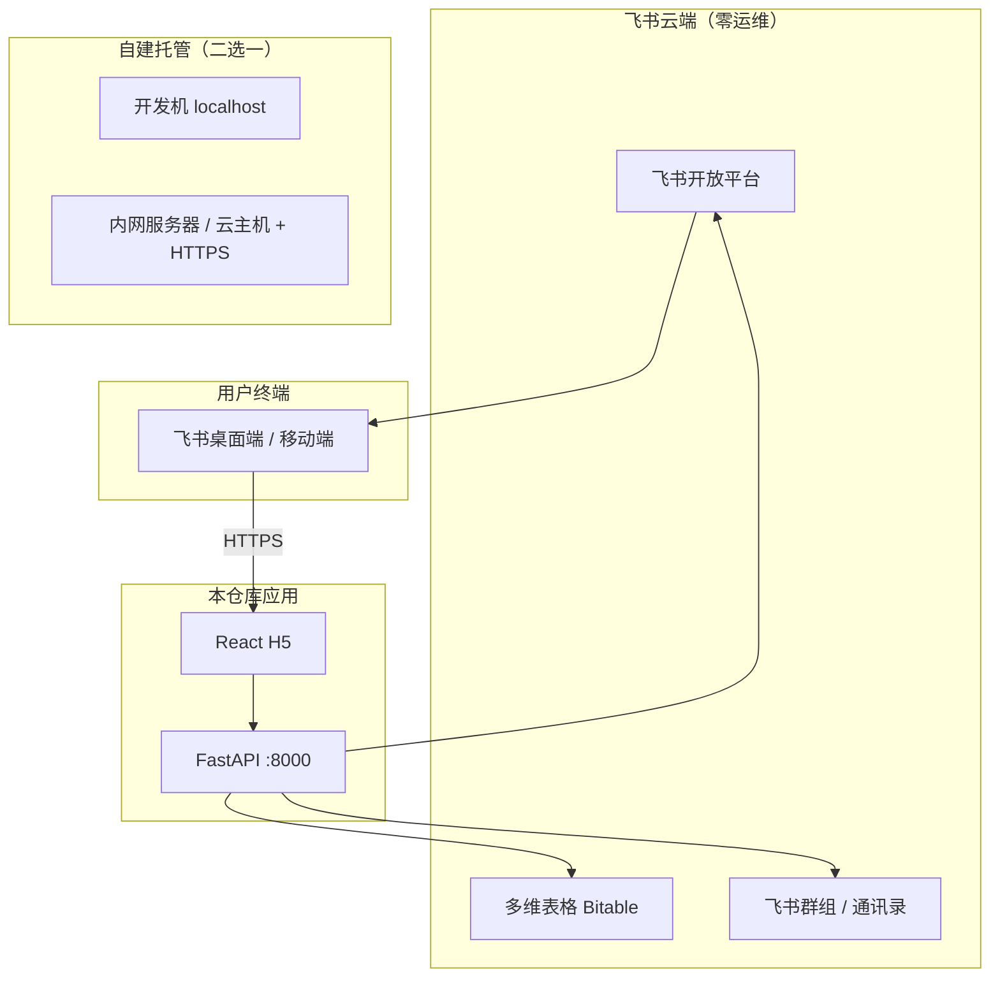

# 物料出入库管理系统 — 环境需求

> **文档状态**：v1.1  
> **最后更新**：2026-06-11  
> **依据文档**：[产品设计文档](./产品设计文档.md)、[架构设计文档](./架构设计文档.md)

---

## 1. 文档说明

本文档汇总 MVP 实施所需的**全部环境与配置项**，说明「需要准备什么」以及「如何配置」。按实施顺序组织，便于 P0～P1 阶段逐项落地。

**MVP 技术形态（组合方案）**：

```
Erniu/官方 Bitable 模板 + lark-samples 网页应用 + 自研薄层（4 H5 页 + 8 API）
```

---

## 2. 环境总览

系统涉及四类环境，职责如下：




| 环境类别         | 用途                        |
| ------------ | ------------------------- |
| 飞书企业租户       | 身份、Bitable、工作台、通知         |
| 飞书开放平台自建应用   | 免登、JSAPI、Bitable API      |
| Bitable 多维表格 | 五表数据存储                    |
| 开发者本机        | 编码、本地 API/H5 调试           |
| HTTPS 托管主机   | 飞书网页应用主页、免登回调             |
| 内网穿透（开发期）    | 飞书免登 / JSAPI 联调（尚未有正式域名时） |


---

## 3. 分阶段环境需求

架构文档 §7.5：**内网 / 公网最终方案可后置，不阻塞 P0/P1 开发**。


| 阶段       | 任务                        | 所需环境                             | 可否暂不决定生产部署 |
| -------- | ------------------------- | -------------------------------- | ---------- |
| **P0**   | fork Bitable 模板、改五表、录初始数据 | 飞书企业 + Bitable                   | ✅          |
| **P0**   | 创建飞书自建应用                  | 飞书开放平台（管理员权限）                    | ✅          |
| **P1**   | FastAPI 业务 + Bitable API  | 本机 Python + 可访问 `open.feishu.cn` | ✅          |
| **P1**   | H5 页面开发                   | 本机 Node.js + Vite dev server     | ✅          |
| **P1**   | 飞书免登 / JSAPI 联调           | **飞书可访问的 HTTPS URL**             | ⚠️ 需临时方案   |
| **P1 末** | 工作台正式上架                   | **稳定 HTTPS 主页 URL**              | ❌ 上线前必须确定  |


---

## 4. 开发者本机环境

### 4.1 硬件与系统


| 项    | 要求                                     |
| ---- | -------------------------------------- |
| 操作系统 | Windows / macOS / Linux 均可             |
| 网络   | 能访问 GitHub、`open.feishu.cn`、npm / PyPI |
| 内存   | 建议 ≥ 8 GB（前后端同时开发）                     |


### 4.2 必装软件


| 软件          | 版本建议                   | 用途                                                                     |
| ----------- | ---------------------- | ---------------------------------------------------------------------- |
| **Git**     | 最新稳定版                  | 代码版本管理；clone [lark-samples](https://github.com/larksuite/lark-samples) |
| **Python**  | 3.10+（文档称 3.x）         | FastAPI 后端                                                             |
| **Node.js** | 18 LTS 或 20 LTS        | React H5 前端（Vite）                                                      |
| **包管理器**    | pip + npm（或 pnpm/yarn） | 依赖安装                                                                   |


#### 4.2.1 安装命令示例

Windows 推荐使用 `winget`：

```powershell
winget install --id Git.Git -e --source winget
winget install --id Python.Python.3 -e --source winget
winget install --id OpenJS.NodeJS.LTS -e --source winget
```

macOS 推荐使用 Homebrew：

```bash
brew install git python node
```

Linux 以系统包管理为主，例如 Ubuntu：

```bash
sudo apt update
sudo apt install git python3 python3-venv python3-pip nodejs npm
```

> 安装完成后，检查版本：
> `git --version`、`python --version`、`node --version`、`npm --version`

### 4.3 Python 依赖（后端）


| 包               | 用途                         |
| --------------- | -------------------------- |
| `fastapi`       | Web 框架                     |
| `uvicorn`       | ASGI 服务                    |
| `lark-oapi`     | 飞书 Open API / Bitable CRUD |
| `python-dotenv` | 读取 `.env`                  |


#### 4.3.1 安装命令示例

```bash
cd backend
python -m venv .venv
# Windows:
.\.venv\Scripts\activate
# macOS/Linux:
source .venv/bin/activate
pip install --upgrade pip
pip install fastapi uvicorn lark-oapi python-dotenv
```

如果仓库提供 `requirements.txt`，请使用：

```bash
pip install -r requirements.txt
```

> 若你在 `backend` 目录下已有 `.venv`，只需激活后执行 `pip install -r requirements.txt`。

> 免登与 JSAPI 签名逻辑应以 `lark-samples` 的 Python 模板或迁入的实现为准，尽量不要重新造轮子。

### 4.4 Node.js 依赖（前端）


| 依赖方向         | 说明                                               |
| ------------ | ------------------------------------------------ |
| React + Vite | 从 lark-samples `react_and_nodejs/web_app` 迁入     |
| 飞书 H5 SDK    | 免登 `tt.requestAuthCode`、`h5sdk.config`（JSAPI 鉴权） |
| UI 库         | 如 Ant Design Mobile，4 个业务页即可                     |

#### 4.4.1 安装命令示例

```bash
cd frontend
npm install
```

如果选择 `pnpm` 或 `yarn`：

```bash
pnpm install
# 或
yarn install
```

推荐安装 UI 库：

```bash
npm install antd-mobile
# 或
npm install @ant-design/icons-react-native
```

> 本地启动示例：
> `npm run dev` 或 `pnpm run dev`。
### 4.5 本机启动（开发期参考）

```bash
# 后端（示例）
cd backend
python -m venv .venv
# Windows: .venv\Scripts\activate
source .venv/bin/activate
pip install -r requirements.txt
cp .env.example .env   # 填入飞书凭证与 Bitable ID
uvicorn app.main:app --reload --port 8000

# 前端（示例）
cd frontend
npm install
npm run dev             # 通常 http://localhost:5173
```

---

## 5. 飞书企业环境

### 5.1 前置条件


| 项      | 要求                                  |
| ------ | ----------------------------------- |
| 飞书企业租户 | 团队已在使用的飞书组织                         |
| 管理员权限  | 至少一名成员能：创建自建应用、配置工作台、管理 Bitable 协作者 |
| 终端     | 飞书**桌面端 + 移动端**（扫码、搜索等场景）           |


### 5.2 飞书群组（权限落地）

在产品文档 §3.8.1 建议创建三个群组，与三角色对应：


| 飞书群组       | 角色     | 用途                     |
| ---------- | ------ | ---------------------- |
| `物料管理-管理员` | ADMIN  | 应用/Bitable 管理、纠错、自动化配置 |
| `物料管理-库管`  | KEEPER | 入库、主数据维护               |
| `物料管理-全员`  | USER   | 搜索、出库、查看库存             |


**配置步骤**：

1. 在飞书创建上述三个群组，按角色邀请成员。
2. 后端角色校验：通过群组成员关系判定 `ADMIN` / `KEEPER` / `USER`（架构文档倾向**飞书群组**，非 Bitable 人员表）。
3. 人员变动：入职加入 `物料管理-全员`；离职从所有物料群组移除。

> 后端 `.env` 中需配置各群组 **chat_id**（或等价标识），供 API 鉴权使用（实施时从 lark-samples 迁入后补充）。

---

## 6. 飞书开放平台 — 自建应用配置

### 6.1 创建应用

1. 登录 [飞书开放平台](https://open.feishu.cn/) → **创建企业自建应用**。
2. 记录 **App ID**、**App Secret**（仅后端使用，**禁止**写入前端或提交 Git）。

### 6.2 应用能力


| 配置项     | 要求                                                         |
| ------- | ---------------------------------------------------------- |
| 应用能力    | 开启 **网页应用**                                                |
| 桌面端主页   | `https://<your-domain>/`                                   |
| 移动端主页   | 同上（响应式 H5，与桌面共用）                                           |
| 重定向 URL | 免登 OAuth 回调，如 `https://<your-domain>/auth/feishu/callback` |
| 可见范围    | 组织内，或 `物料管理-全员` 群组成员                                       |


参考：[将网页应用嵌入飞书工作台](https://open.feishu.cn/document/embed-web-app-into-feishu-workbench/introduction)

### 6.3 API 权限（最小集）

在开放平台「权限管理」中申请并发布：

```json
{
  "tenant": [
    "bitable:app",
    "base:table:read",
    "base:table:update",
    "contact:user.base:readonly"
  ]
}
```


| 权限                                      | 用途               |
| --------------------------------------- | ---------------- |
| `bitable:app`                           | 读写多维表格           |
| `base:table:read` / `base:table:update` | 表级读写             |
| `contact:user.base:readonly`            | 获取用户基础信息（操作人、角色） |


**网页应用必做流程**（架构文档 §8.2）：

1. [嵌入工作台](https://open.feishu.cn/document/embed-web-app-into-feishu-workbench/introduction) — 配置主页 URL
2. [免登](https://open.feishu.cn/document/client-docs/h5/development-guide/basic-concepts) — `tt.requestAuthCode` → 后端换 `user_access_token`
3. [JSAPI 鉴权](https://open.feishu.cn/document/client-docs/h5/development-guide/basic-concepts) — `h5sdk.config` → 扫码等能力

**安全约束**：前端不得持有 App Secret 或 `tenant_access_token`；所有 Bitable 写操作经后端 API。

### 6.4 工作台发布

1. 在飞书管理后台将应用添加到**工作台**。
2. 设置应用可见范围为 `物料管理-全员`（或更大范围按需）。
3. 确认桌面端、移动端均可打开并完成免登。

---

## 7. Bitable（多维表格）环境

### 7.1 创建与模板


| 步骤  | 操作                                                                                                                                                                    |
| --- | --------------------------------------------------------------------------------------------------------------------------------------------------------------------- |
| 1   | Fork [Erniu Bitable 模板](https://ccn1hpzj4iz4.feishu.cn/base/DyAYb1D2RaYcbQsjdsdcZOEOnad) 或 [飞书官方库存模板](https://www.feishu.cn/content/article/7582519149600017604) 到本组织 |
| 2   | 按 PRD 调整为 **五表** 模型（见 §7.2）                                                                                                                                           |
| 3   | 录入初始分类、库位、样例物料（P0）                                                                                                                                                    |
| 4   | 从 Bitable URL 获取 **app_token**、各表 **table_id**，写入后端 `.env`                                                                                                            |


### 7.2 五表结构


| 表名             | 用途                                    |
| -------------- | ------------------------------------- |
| `categories`   | 物料分类                                  |
| `locations`    | 库位（货柜/货架/暂存区等）                        |
| `materials`    | 物料主数据                                 |
| `inventory`    | 当前库存（`(material_id, location_id)` 唯一） |
| `transactions` | 出入库流水（只追加）                            |


Erniu 模板映射参考架构文档 §3.4.2；若与 PRD 冲突，**以 PRD 五表为准**。

### 7.3 协作者与高级权限

**协作者**（Bitable → 分享 → 管理协作者）：


| 群组       | Bitable 基础权限  |
| -------- | ------------- |
| 物料管理-管理员 | 可管理           |
| 物料管理-库管  | 可编辑（配合高级权限收窄） |
| 物料管理-全员  | 可阅读 + 指定视图可写  |


**高级权限**（多维表格 → … → 高级权限 → 开启）：

1. 创建权限角色：`角色-管理员`、`角色-库管`、`角色-用户`。
2. 分别关联上述飞书群组。
3. 按表/视图/字段配置（产品文档 §3.8.2、架构文档 §9.5）。

**关键字段约束**：


| 表.字段                 | 库管 / 用户  | 管理员     |
| -------------------- | -------- | ------- |
| `inventory.quantity` | **只读**   | 可编辑（纠错） |
| `transactions.`*     | 只追加 / 只读 | 可编辑（纠错） |


**视图隔离**（建议创建，产品文档 §3.8.2）：


| 视图                | 面向角色          |
| ----------------- | ------------- |
| 物料-全员只读 / 物料-库管维护 | USER / KEEPER |
| 库位-全员只读 / 库位-库管维护 | USER / KEEPER |
| 库存-全员只读           | ALL           |
| 入库-库管操作           | KEEPER        |
| 出库-全员操作           | ALL           |
| 流水-全员只读 / 流水-管理员  | ALL / ADMIN   |


**其他**：

- 关闭 Bitable **外链分享**到组织外。
- 定期导出 Bitable 做备份（建议每周）。

---

## 8. 后端环境变量（`.env`）

在 `backend/.env` 配置（提供 `.env.example`，**勿提交**真实 Secret 到 Git）：

```env
# 飞书自建应用
FEISHU_APP_ID=cli_xxxxxxxx
FEISHU_APP_SECRET=xxxxxxxxxxxxxxxx

# 免登 / JSAPI（按 lark-samples 与最终部署域名填写）
FEISHU_REDIRECT_URI=https://<your-domain>/auth/feishu/callback

# Bitable
BITABLE_APP_TOKEN=xxxxxxxx
BITABLE_TABLE_CATEGORIES=tblxxxxxxxx
BITABLE_TABLE_LOCATIONS=tblxxxxxxxx
BITABLE_TABLE_MATERIALS=tblxxxxxxxx
BITABLE_TABLE_INVENTORY=tblxxxxxxxx
BITABLE_TABLE_TRANSACTIONS=tblxxxxxxxx

# 角色群组 chat_id（后端鉴权 ADMIN / KEEPER / USER）
FEISHU_GROUP_ADMIN=oc_xxxxxxxx
FEISHU_GROUP_KEEPER=oc_xxxxxxxx
FEISHU_GROUP_USER=oc_xxxxxxxx

# 服务端口
API_HOST=0.0.0.0
API_PORT=8000
```


| 变量                         | 获取方式                    |
| -------------------------- | ----------------------- |
| `FEISHU_APP_ID` / `SECRET` | 开放平台 → 应用凭证             |
| `BITABLE_APP_TOKEN`        | 多维表格 URL 中 `base/` 后的一段 |
| `BITABLE_TABLE_*`          | 各数据表设置或 Open API 列举     |
| 群组 chat_id                 | 飞书群组信息 / Open API       |


---

## 9. 托管与 HTTPS 部署

### 9.1 要求


| 项    | 说明                                            |
| ---- | --------------------------------------------- |
| 协议   | **HTTPS**（飞书网页应用强制要求）                         |
| H5   | React `build` 静态资源                            |
| 后端   | FastAPI（默认 `:8000`），与 H5 **同域**或正确配置 **CORS** |
| 反向代理 | Caddy / Nginx（低访问量单进程即可）                      |
| 出站网络 | 后端需能访问 `open.feishu.cn`（与业务是否在内网无关）           |


### 9.2 部署方案（二选一，上线前确定）


| 方案             | 适用          | 配置要点                                |
| -------------- | ----------- | ----------------------------------- |
| **云主机 + 公网域名** | 有公网 IP / 域名 | DNS → 服务器；Let's Encrypt 或云厂商证书      |
| **内网服务器**      | 仅公司内网       | 内网 DNS + 企业 HTTPS 证书；或内网穿透使飞书客户端可访问 |


### 9.3 开发期临时联调（不必等最终内网方案）

任选其一即可开始免登联调：


| 方式         | 说明                                        |
| ---------- | ----------------------------------------- |
| **内网穿透**   | frp、ngrok 等提供临时 HTTPS 域名，填入飞书应用主页与重定向 URL |
| **办公网预览机** | 一台可被飞书访问的机器部署预览版                          |


### 9.4 生产部署参考结构

```
https://stock.example.com/          → H5 静态文件（React build）
https://stock.example.com/api/      → FastAPI（或同域反代到 :8000）
https://stock.example.com/auth/feishu/callback  → 免登回调
```

部署清单：

- [ ] HTTPS 证书有效  
- [ ] 飞书应用桌面端/移动端主页 URL 已更新  
- [ ] 重定向 URL 与 `.env` 中 `FEISHU_REDIRECT_URI` 一致  
- [ ] `GET /health` 健康检查可用（架构文档 §10）  
- [ ] 进程守护：systemd / pm2

---

## 10. 环境配置检查清单

### P0 — 数据与应用就绪

- [ ] 飞书企业租户可用，管理员账号就绪  
- [ ] Fork Bitable 模板，五表字段对齐 PRD  
- [ ] 录入分类、库位、样例物料  
- [ ] 创建三个物料管理群组并添加成员  
- [ ] Bitable 协作者 + 高级权限 + 角色视图已配置  
- [ ] 飞书开放平台创建自建应用，开启网页应用  
- [ ] 申请并发布 bitable / contact 等 API 权限  
- [ ] 记录 App ID、Secret、app_token、各 table_id  

### P1 — 开发与联调

- [ ] 本机安装 Git、Python 3.10+、Node.js 18+  
- [ ] clone / 迁入 lark-samples，后端 `lark-oapi` 可读写 Bitable  
- [ ] `backend/.env` 配置完整，本地 `GET /me` 可返回用户与角色  
- [ ] 前端 4 页（搜索、出库、入库、详情）对接 8 个 MVP API  
- [ ] 临时 HTTPS 或预览环境完成免登联调  
- [ ] 工作台添加应用，可见范围正确  

### 上线前

- [ ] 确定最终 HTTPS 域名并更新飞书应用主页 / 回调 URL  
- [ ] 生产 `.env` 与证书、反向代理就绪  
- [ ] 验收：库管「收货 → 入库 → 研发领用 → 查库存」全流程  
- [ ] Bitable 备份策略（定期导出）  

---

## 11. 关联文档


| 文档                        | 相关内容                                   |
| ------------------------- | -------------------------------------- |
| [产品设计文档](./产品设计文档.md)     | §3.8 飞书落地、§7 页面、§10 技术路线、§11 实施计划      |
| [架构设计文档](./架构设计文档.md)     | §3.4 实施路径、§7 部署、§8 集成、§9 安全与权限、§12 技术栈 |
| [AGENTS.md](../AGENTS.md) | 开发约定与 MVP 边界                           |


---

## 12. 安装与下载总汇

### 12.1 一次性准备软件

Windows (推荐 `winget`)：

```powershell
winget install --id Git.Git -e --source winget
winget install --id Python.Python.3 -e --source winget
winget install --id OpenJS.NodeJS.LTS -e --source winget
```

macOS：

```bash
brew install git python node
```

Ubuntu / Debian：

```bash
sudo apt update
sudo apt install git python3 python3-venv python3-pip nodejs npm
```

### 12.2 后端依赖安装

```bash
cd backend
python -m venv .venv
# Windows:
.\.venv\Scripts\activate
# macOS/Linux:
source .venv/bin/activate
pip install --upgrade pip
pip install fastapi uvicorn lark-oapi python-dotenv
```

如果仓库提供 `requirements.txt`：

```bash
pip install -r requirements.txt
```

### 12.3 前端依赖安装

```bash
cd frontend
npm install
```

如果使用 pnpm / yarn：

```bash
pnpm install
# or
yarn install
```

推荐额外安装 UI 库：

```bash
npm install antd-mobile
```

### 12.4 本地启动参考

```bash
# 后端
cd backend
.\.venv\Scripts\activate   # Windows
# 或 source .venv/bin/activate
uvicorn app.main:app --reload --port 8000

# 前端
cd frontend
npm run dev
```

### 12.5 飞书开发环境准备

1. 注册飞书开发者账号并登录 [飞书开放平台](https://open.feishu.cn/)。
2. 创建自建应用，记录 `App ID` / `App Secret`。
3. 配置网页应用主页与重定向 URL，并申请 `bitable:app`、`base:table:read`、`base:table:update`、`contact:user.base:readonly` 等权限。
4. 通过 `lark-samples` 迁入免登与 JSAPI 逻辑，后端 `.env` 完成配置。

---

## 13. 变更记录


| 版本   | 日期         | 变更内容                         |
| ---- | ---------- | ---------------------------- |
| v1.0 | 2026-06-11 | 初稿：从产品设计文档、架构设计文档提炼环境需求与配置步骤 |
| v1.1 | 2026-06-11 | 移除非 MVP 环境与「不需要的环境」说明，仅保留必需项 |


